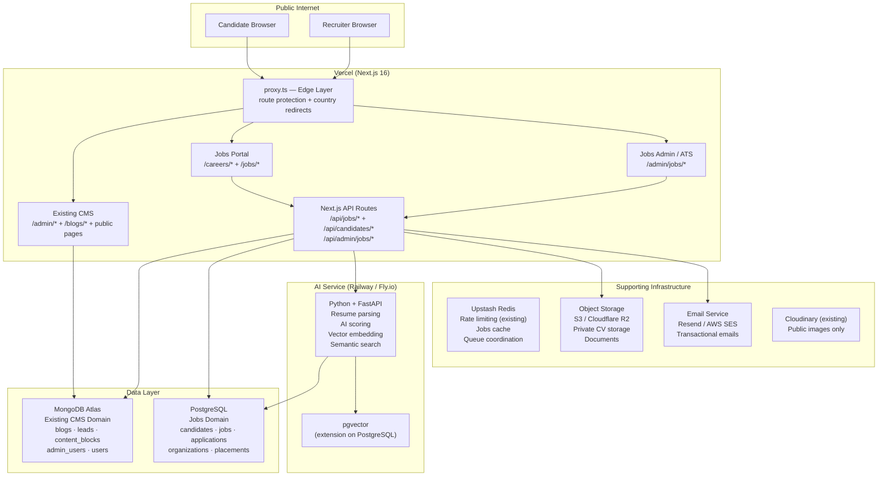
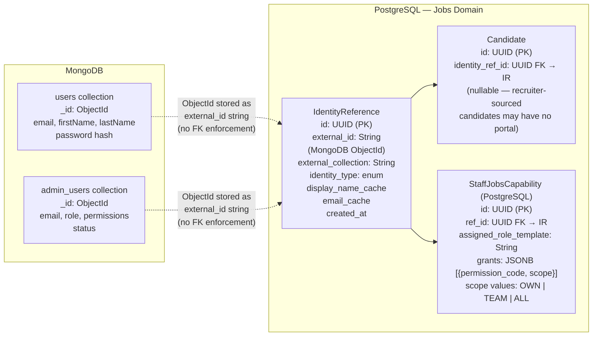
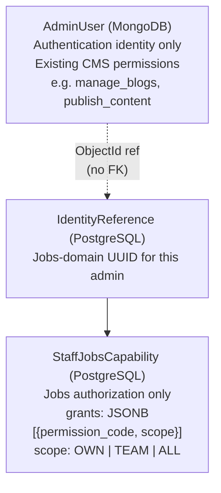
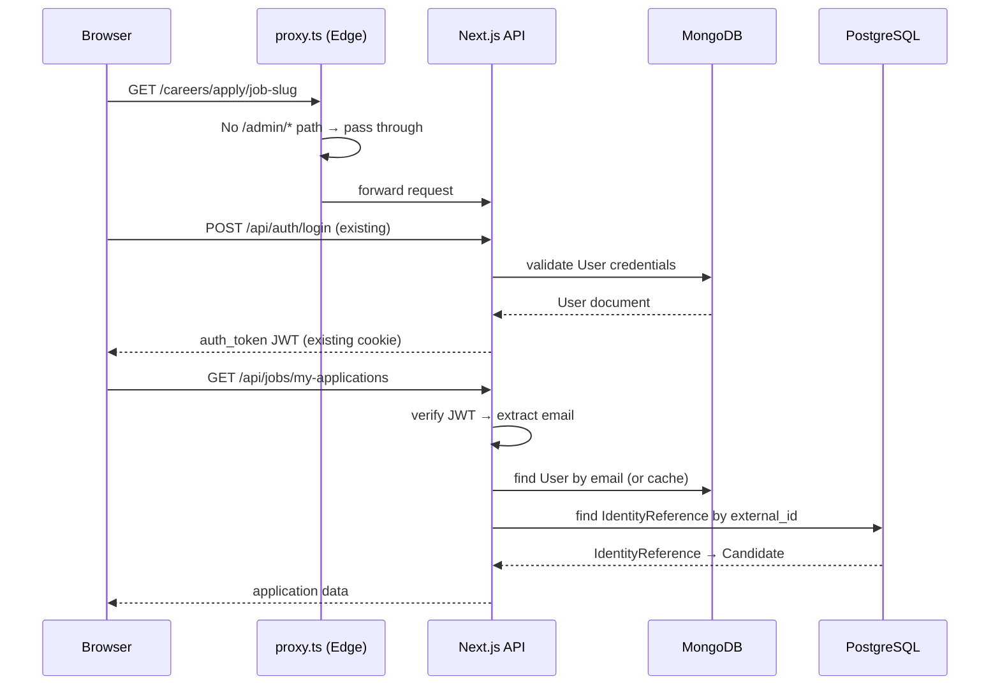
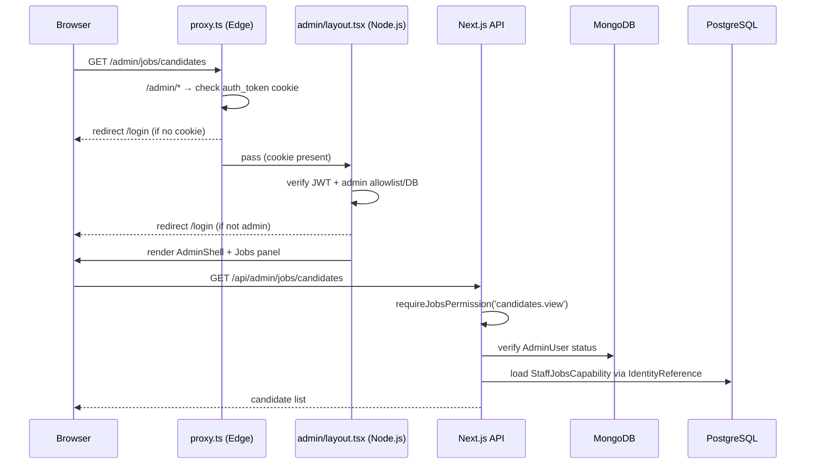
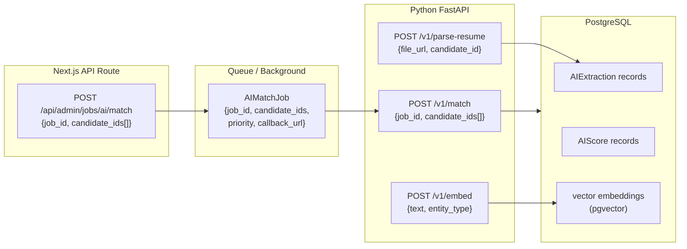
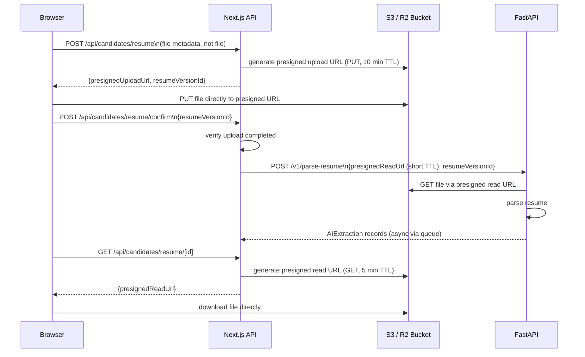
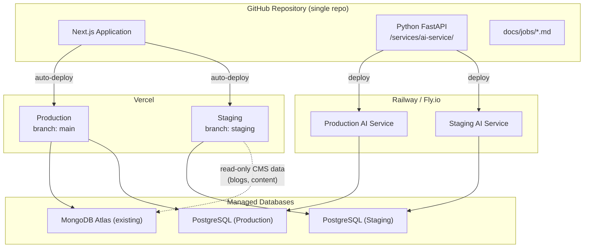

# Estabizz Jobs — System Architecture

> **Document:** 02-SYSTEM-ARCHITECTURE.md  
> **Phase:** 0C — System Architecture  
> **Status:** Updated post-Codex review — superseded on conflicts by `05-ARCHITECTURE-FREEZE.md`  
> **Date:** 2026-08-08  
> **Preceding documents:** `00-CURRENT-SYSTEM-AUDIT.md`, `01-PRODUCT-SCOPE.md`  
> **Freeze document:** `docs/jobs/05-ARCHITECTURE-FREEZE.md`

---

## 1. Architecture Overview

Estabizz Jobs is built as an additive module inside the existing Estabizz Next.js application. It does not replace or refactor the existing system. It introduces two new infrastructure dependencies — a PostgreSQL database and a Python/FastAPI AI service — alongside three new functional layers: the candidate portal, the recruiter ATS, and the AI processing pipeline.



---

## 2. Domain Separation

The two data domains are cleanly separated. No cross-domain writes occur at runtime.

| Domain | Database | Responsibility |
|---|---|---|
| **CMS Domain** | MongoDB | Blogs, content blocks, leads, media assets, admin users, public users, backup snapshots, regulatory updates |
| **Jobs Domain** | PostgreSQL | Candidates, jobs, applications, organizations, interviews, offers, placements, AI scores, audit events |

**Write ownership rule:** Next.js API routes own all business entity mutations (Candidate, Job, Application, Organization, Placement, Offer, Interview, etc.). The FastAPI AI service owns only its processing output tables: `AIExtraction`, `AIScore`, and `EntityEmbedding`. The FastAPI service may not update any candidate or application core state directly. A Next.js API route that reads Jobs data writes only to PostgreSQL. A Next.js API route that reads CMS data writes only to MongoDB. Neither domain queries the other's database at the ORM level.

**Cross-domain references** are managed by `IdentityReference` and `StaffReference` — stable Jobs-domain UUID records that store MongoDB ObjectId strings as `external_id`. See Section 4.

---

## 3. Responsibility Matrix

| Concern | Owner | Notes |
|---|---|---|
| **Public user auth** | Next.js + MongoDB | Existing JWT flow; `auth_token` cookie; `User` collection |
| **Admin/recruiter auth** | Next.js + MongoDB | Existing `AdminUser` + `proxy.ts` + `admin/layout.tsx` |
| **Candidate portal session** | Next.js + MongoDB | Same `auth_token` reused; extended by Jobs API to locate PostgreSQL Candidate |
| **Jobs RBAC enforcement** | Next.js API routes | `requireJobsPermission()` guard reads capability from PostgreSQL via `StaffReference` |
| **CMS content** | Next.js + MongoDB | Unchanged |
| **Jobs transactional data** | PostgreSQL + Prisma | All Jobs-domain entities |
| **Resume / document storage** | Object Storage (S3/R2) | Private, presigned URLs only; never Cloudinary |
| **AI resume parsing** | Python FastAPI | Reads file from Object Storage; writes `AIExtraction` records to PostgreSQL only |
| **AI candidate scoring** | Python FastAPI + pgvector | Reads PostgreSQL; writes `AIScore` (with embedded explanation JSONB) and `EntityEmbedding` only |
| **Vector embeddings** | pgvector (PostgreSQL ext.) | Stored in `EntityEmbedding` table; managed exclusively by FastAPI |
| **Background job dispatch** | Next.js (queue producer) | Enqueues jobs via Upstash QStash; FastAPI / workers consume |
| **Background job execution** | FastAPI / queue workers | Parse, embed, score, notify |
| **Transactional email** | Email Service (Resend/SES) | Invoked by Next.js API or queue workers |
| **Rate limiting** | Upstash Redis | Existing implementation; extended for Jobs candidate-facing endpoints |
| **Caching** | Upstash Redis | Jobs-specific: job listing cache, candidate search result cache |
| **Public image CDN** | Cloudinary | Blog images, marketing images only — not CVs |
| **Audit logging** | PostgreSQL | `AuditEvent` table; written by all Jobs operations |
| **Analytics** | GA4 (existing) | Page-level; Jobs-specific events added to existing GA4 tag |
| **Search** | PostgreSQL (structured) + pgvector (semantic) | Hybrid search; no separate search service in V1 |
| **Observability** | Vercel logs + FastAPI logs | V1 uses platform logging; structured logging in FastAPI |
| **SEO** | Next.js (`buildPageMetadata`) + `sitemap.ts` | Existing helpers reused for job pages |

---

## 4. Identity Boundary Design

This is the most critical architectural boundary in the system. MongoDB and PostgreSQL must never share foreign keys.



### 4.1 IdentityReference

Every MongoDB identity that participates in the Jobs domain gets one `IdentityReference` row with:
- A stable Jobs-domain UUID (`id`) — this is used as FK throughout all Jobs tables
- `external_id` — the MongoDB ObjectId stored as a plain string
- `external_collection` — `'users'` or `'admin_users'`
- `identity_type` — `'candidate_user'`, `'admin_user'`, or `'system'`
- Cached display fields (`display_name_cache`, `email_cache`) — denormalised for query convenience; not authoritative

**Key property:** All Jobs domain tables reference `IdentityReference.id` (UUID), never a MongoDB ObjectId. No PostgreSQL FK points to MongoDB.

**Synchronisation:** Cached name/email fields are updated lazily when a Jobs API route fetches the record and detects staleness. They are never used for authentication decisions.

### 4.2 Candidate Identity Link

A PostgreSQL `Candidate` row has an optional `identity_ref_id` FK pointing to an `IdentityReference` for a `users` MongoDB document.

- **Portal-registered candidates:** `identity_ref_id` is set at registration. The candidate's Next.js session identifies them by JWT email → MongoDB User → `IdentityReference` → `Candidate`.
- **Recruiter-sourced candidates:** `identity_ref_id` is null until the candidate registers via the portal. The `Candidate` record exists independently.
- **Portal registration for an existing record:** When a recruiter-sourced candidate registers, the portal flow detects a potential match (by email) and links `identity_ref_id` to the existing `Candidate` or prompts recruiter to confirm the merge.

### 4.3 Staff Identity in Jobs

Estabizz recruiters authenticate via `AdminUser` (MongoDB). Their Jobs-domain identity is an `IdentityReference` with `identity_type: 'admin_user'`.

Jobs-specific capabilities (permissions) are stored in a `StaffJobsCapability` table keyed on `IdentityReference.id`. This table is separate from the existing `AdminUser.permissions` array (which controls CMS access). A recruiter may have CMS permissions and Jobs permissions independently.

**`StaffJobsCapability.grants` is a `JSONB` array** — not a flat `TEXT[]`. Each entry has the shape `{permission_code: string, scope: "OWN" | "TEAM" | "ALL"}`. Scope determines which records the permission applies to: own records only, team records, or all records. `TEAM` requires `RecruitmentTeam` membership (deferred to V2). In V1, effective scopes are `OWN` and `ALL`.

**MongoDB `AdminUser` is the authentication identity only.** It is not queried for Jobs authorization. The PostgreSQL `StaffJobsCapability` row is the single source of truth for all Jobs access decisions.



---

## 5. Authentication and Session Flow

### 5.1 Candidate Portal Authentication



### 5.2 Recruiter Authentication



### 5.3 Application Stage Transition Rules

Stage transitions are governed by `ApplicationStageTransition` — a configuration table in PostgreSQL defining the allowed directed edges in the application stage state machine.

Each row describes one permitted transition:
- `from_stage` / `to_stage` — the stage pair this rule covers
- `required_permission` — the Jobs permission the actor must hold (e.g. `applications.change_stage`)
- `requires_reason` — whether a written reason is mandatory
- `requires_interview_record` — whether an `Interview` row must exist before this transition is allowed
- `is_terminal` — whether `to_stage` is a terminal state (no further transitions)

The `PUT /api/admin/jobs/applications/[id]/stage` route validates the requested transition against this table before persisting. Transitions not present in the table are rejected. This table is seeded at deployment and is not user-editable in V1 (recruiter settings do not override transition rules).

AI systems may not trigger stage transitions directly. AI scores are advisory inputs; a human actor with the required permission must initiate every stage change.

### 5.4 requireJobsPermission Guard

A new Next.js API guard, analogous to the existing `requirePermission()` but for Jobs capabilities:

```
requireJobsPermission(request, 'candidates.view', { minScope: 'OWN' })
  1. Verify JWT → extract email
  2. Confirm email is active AdminUser (existing allowlist + DB check)
  3. Find IdentityReference for this AdminUser
  4. Load StaffJobsCapability.grants JSONB from PostgreSQL
  5. Find grant where permission_code = 'candidates.view'
  6. Confirm grant.scope satisfies minScope requirement → proceed or 403
  7. Return effective scope → used by query layer to filter result set
```

The effective scope returned by step 7 is applied to the query: `OWN` adds `WHERE assigned_recruiter_ref_id = $caller_ref_id`; `ALL` adds no filter.

---

## 6. Frontend Architecture

### 6.1 Candidate Portal (Public-Facing) — Frozen Routes

Routes under `app/(public)/` (public group layout — no auth requirement for browsing):

```
Public (unauthenticated):
  /jobs                          — Job listing / search
  /jobs/[slug]                   — Job detail + apply CTA
  /careers                       — Estabizz Careers hub (about working with Estabizz)

Candidate-authenticated (/api/auth/login → auth_token cookie required):
  /candidates/register           — Portal registration / link existing profile
  /candidates/dashboard          — Candidate dashboard
  /candidates/profile            — Candidate profile editor
  /candidates/profile/resume     — Resume upload and version history
  /candidates/applications       — Candidate's applications list
  /candidates/applications/[id]  — Single application detail + status timeline
```

These routes are frozen. Additions require a documented change request against `05-ARCHITECTURE-FREEZE.md`.

**Design constraints:**
- Uses existing Tailwind design system and brand colours
- Reuses `Navbar`, `Footer`, `ThemeProvider`, `FAQAccordion`, `ServicePageLayout`
- `JobCard` component modelled on `BlogCard` pattern
- No new CSS frameworks or component libraries
- Responsive — mobile and desktop

### 6.2 Jobs Admin / ATS (Recruiter-Facing) — Frozen Routes

New routes under `app/admin/jobs/`, following the existing `page.tsx` + `*Client.tsx` pattern. All routes require `auth_token` + minimum Jobs capability:

```
/admin/jobs                               — Jobs ATS dashboard (requires jobs.view)
/admin/jobs/jobs                          — Job list (requires jobs.view)
/admin/jobs/jobs/new                      — Create job (requires jobs.create)
/admin/jobs/jobs/[id]                     — Job detail (requires jobs.view)
/admin/jobs/jobs/[id]/edit                — Edit job (requires jobs.edit)
/admin/jobs/jobs/[id]/applications        — Job pipeline view (requires applications.view)
/admin/jobs/candidates                    — Candidate database search (requires candidates.view)
/admin/jobs/candidates/new                — Add recruiter-sourced candidate (requires candidates.create)
/admin/jobs/candidates/[id]               — Candidate full profile (requires candidates.view)
/admin/jobs/candidates/[id]/edit          — Edit candidate (requires candidates.edit)
/admin/jobs/applications                  — All applications pipeline (requires applications.view)
/admin/jobs/applications/[id]             — Application detail + stage history (requires applications.view)
/admin/jobs/clients                       — Client organizations (requires jobs.view)
/admin/jobs/clients/[id]                  — Client detail + contacts + jobs (requires jobs.view)
/admin/jobs/placements                    — Placements + commercial tracking (requires placements.manage)
/admin/jobs/placements/[id]               — Placement detail + invoice tracking (requires placements.manage)
/admin/jobs/reports                       — Recruitment analytics (requires jobs.view)
/admin/jobs/settings                      — Jobs settings: stages, pipeline config (requires jobs.super_admin)
/admin/jobs/settings/staff                — Staff capabilities management (requires jobs.super_admin)
```

These routes are frozen. Additions require a documented change request against `05-ARCHITECTURE-FREEZE.md`.

**AdminShell extension:**
A new "Jobs" group is added to the `AdminShell.tsx` sidebar nav. The existing CMS and blog nav items are untouched. The Jobs nav group is gated by `jobs.view` capability.

### 6.3 SEO Integration

Job listing pages are Server Components that:
- Call `buildPageMetadata()` from `lib/seo/pageMetadata.ts` with job title, description, and canonical path
- Return structured data (JSON-LD `JobPosting` schema) for Google Jobs indexing
- Are included in `app/sitemap.ts` — the sitemap generator is extended to query published jobs from PostgreSQL

---

## 7. API Layer

### 7.1 API Route Namespace

| Prefix | Auth | Purpose |
|---|---|---|
| `/api/jobs/*` | Public or `auth_token` | Candidate-facing: job listing, application submission, profile |
| `/api/candidates/*` | `auth_token` (candidate) | Candidate's own profile, applications, resume upload |
| `/api/admin/jobs/*` | `auth_token` + Jobs permission | Recruiter ATS: job management, candidate search, pipeline |

### 7.2 Key API Contracts (V1)

| Route | Method | Permission | Description |
|---|---|---|---|
| `/api/jobs` | GET | Public | List published jobs |
| `/api/jobs/[slug]` | GET | Public | Job detail |
| `/api/jobs/apply` | POST | Candidate session | Submit application |
| `/api/candidates/profile` | GET/PUT | Candidate session | Own profile |
| `/api/candidates/resume` | POST | Candidate session | Upload resume |
| `/api/candidates/applications` | GET | Candidate session | Own applications |
| `/api/admin/jobs/jobs` | GET/POST/PUT | `jobs.view` / `jobs.create` / `jobs.edit` | Job management |
| `/api/admin/jobs/candidates` | GET | `candidates.view` | Candidate search |
| `/api/admin/jobs/candidates/[id]` | GET/PUT | `candidates.view` / `candidates.edit` | Candidate profile |
| `/api/admin/jobs/applications/[id]/stage` | PUT | `applications.change_stage` | Stage transition |
| `/api/admin/jobs/clients` | GET/POST | `jobs.view` | Client organizations |
| `/api/admin/jobs/placements` | GET/POST | `placements.manage` | Placement records |
| `/api/admin/jobs/ai/match` | POST | `candidates.view` | Trigger AI match for job |

---

## 8. Python / FastAPI AI Service

The AI service is a standalone Python FastAPI application deployed separately from Vercel (Railway or Fly.io recommended). It is not part of the Next.js build.



### 8.1 FastAPI Responsibilities

| Endpoint | Description |
|---|---|
| `POST /v1/parse-resume` | Parse CV file (PDF/DOCX) from presigned URL; return structured extraction; write AIExtraction records |
| `POST /v1/embed` | Generate vector embedding for a text payload (candidate profile, job description) |
| `POST /v1/match` | Score candidates against a job; write `AIScore` (explanation embedded as `explanation_payload JSONB`) |
| `POST /v1/search` | Semantic search over candidate embeddings via pgvector |
| `GET /v1/health` | Service health check |

### 8.2 Service-to-Service Authentication

- Next.js → FastAPI: service API key in request header (`X-Service-Key`)
- FastAPI → PostgreSQL: direct connection via `DATABASE_URL`
- Next.js → Object Storage: server-side presigned URL generation
- FastAPI → Object Storage: fetches files via presigned URL provided by Next.js

### 8.3 AI Provider

The Anthropic SDK (`@anthropic-ai/sdk`) is already installed and available in the Next.js application. For the FastAPI service, the Anthropic Python SDK is used. Model and provider choices are deferred — the service contract is stable regardless of which model is called.

---

## 9. Object Storage — Private Document Architecture

All candidate documents (CVs, offer letters, certificates) are stored in a private object storage bucket. Cloudinary is explicitly not used for these files.



**Security properties:**
- Bucket is fully private — no public read
- All access via presigned URLs with short TTL
- NextAPI never proxies file bytes — presigned URLs go directly to the browser
- FastAPI reads files via short-lived presigned URLs
- Candidate can only download their own documents (enforced by NextAPI session check)
- Recruiter file access gated by `candidates.view` permission

---

## 10. Background Processing Architecture

### 10.1 Queue Provider: Upstash QStash

**Selected provider: Upstash QStash** (HTTP-delivered, Vercel-native, serverless-compatible).

QStash is accessed exclusively through an internal abstraction interface — no QStash SDK calls appear in business logic. The interface exposes: `dispatch(jobType, payload, options)`, `retry(jobId)`, `deadLetter(jobId, reason)`. This allows future migration to SQS or Cloudflare Queues without business logic changes.

#### V1 Queue Job Contracts

The contracts below are stable regardless of queue provider.

#### ResumeParseJob
```
{
  job_type: 'resume_parse',
  resume_version_id: UUID,
  candidate_id: UUID,
  file_presigned_url: String,   // short-lived, generated at dispatch time
  priority: 'normal' | 'high',
  created_at: ISO8601,
  attempt: Integer
}
```

#### AIMatchJob
```
{
  job_type: 'ai_match',
  job_id: UUID,
  candidate_ids: UUID[],        // batch of candidates to score against this job
  triggered_by_ref_id: UUID,    // IdentityReference of recruiter who triggered
  priority: 'normal' | 'high',
  created_at: ISO8601,
  attempt: Integer
}
```

#### EmailNotificationJob
```
{
  job_type: 'email_notification',
  template_id: String,          // e.g. 'application_received', 'stage_change'
  recipient_email: String,
  recipient_name: String,
  context: Object,              // template variables
  candidate_id: UUID | null,
  application_id: UUID | null,
  created_at: ISO8601,
  attempt: Integer
}
```

#### EmbedEntityJob
```
{
  job_type: 'embed_entity',
  entity_type: 'candidate' | 'job',
  entity_id: UUID,
  text_payload: String,
  created_at: ISO8601,
  attempt: Integer
}
```

#### SearchIndexJob
```
{
  job_type: 'search_index',
  action: 'upsert' | 'delete',
  entity_type: 'candidate' | 'job',
  entity_id: UUID,
  created_at: ISO8601
}
```

### 10.2 Queue Failure Strategy

- Retry with exponential backoff (implementation-defined)
- Dead-letter queue for failed jobs after max retries
- `AIProcessingRun` record updated with `status: 'failed'` and `error_detail` on failure
- Critical jobs (email, embedding) alert on DLQ; non-critical (re-ranking) degrade silently

---

## 11. Email / Notification Architecture

No email service is currently provisioned. Email is mandatory for Jobs V1 candidate-facing features.

**Recommended service:** Resend or AWS SES.

### 11.1 V1 Email Events

| Event | Trigger | Recipient |
|---|---|---|
| `application_received` | Candidate submits application | Candidate |
| `stage_changed` | Application moves to new stage | Candidate (configurable) |
| `interview_scheduled` | Interview record created | Candidate |
| `offer_extended` | Offer record created | Candidate |
| `candidate_registered` | Portal registration | Candidate (welcome) |
| `task_assigned` | Task assigned to recruiter | Recruiter |
| `follow_up_due` | Scheduled follow-up due | Recruiter |

All emails dispatched via `EmailNotificationJob` in the queue. Direct synchronous email is not used in hot API paths.

---

## 12. Search Architecture

### 12.1 Structured Search (PostgreSQL)

Recruiter candidate search on structured fields:
- Name, email, phone
- Current employer, title
- Skills (join to Skill master)
- Domain experience (join to Domain)
- Location (country, city)
- Notice period, availability
- Status, source

Uses standard PostgreSQL `WHERE` clauses + `GIN` indexes on array fields + `pg_trgm` for fuzzy name search.

### 12.2 Semantic Search (pgvector)

Embeddings are stored in a dedicated `EntityEmbedding` table — never as inline vector columns on `Candidate` or `Job`. This allows multiple embedding models, dimension changes, and provider migrations without altering core entity tables.

`EntityEmbedding` schema:
```
id:             UUID (PK)
entity_type:    'candidate' | 'job'
entity_id:      UUID
embedding:      vector(N)    — dimension configured at provision time
model_provider: String       — e.g. 'openai-text-embedding-3-small'
model_version:  String
dimension:      Integer
created_at:     TIMESTAMPTZ
```

Candidate profile text is embedded (via FastAPI) and written to `EntityEmbedding` with `entity_type = 'candidate'`. Job description text is similarly embedded with `entity_type = 'job'`.

Semantic search queries:
- "Find candidates similar to this job description"
- "Find candidates with experience in SEBI AIF regulations"
- "Find candidates similar to this candidate profile"

Uses `pgvector` `<=>` cosine distance operator with `ivfflat` or `hnsw` index.

### 12.3 Hybrid Search

Full candidate search combines:
1. Structured filter (status, location, skills, domain)
2. Semantic similarity (pgvector cosine distance)
3. AI match score (pre-computed, stored in `AIScore`)
4. Recruiter activity signals (last contacted, active process)

Combined and ranked in the API layer.

---

## 13. Caching Strategy

| Cache key | TTL | Rationale |
|---|---|---|
| `jobs:published:list` | 5 minutes | Public job listing — invalidated on job publish/close |
| `jobs:[slug]:detail` | 10 minutes | Public job detail — invalidated on job edit |
| `candidates:[id]:profile_summary` | 30 seconds | Recruiter views — short TTL, data changes frequently |
| `staff:[ref_id]:capabilities` | 5 minutes | Permissions check — invalidated on capability update |

Upstash Redis (existing) is used for caching. Cache invalidation is explicit (write-through invalidation on mutation routes), not TTL-only for critical data.

---

## 14. Audit Logging

Every significant Jobs action writes an `AuditEvent` record to PostgreSQL. This is distinct from the existing MongoDB `ContentAudit` collection (which covers CMS actions).

```
AuditEvent:
  entity_type:    'candidate' | 'job' | 'application' | 'offer' | 'placement' | 'organization' ...
  entity_id:      UUID
  action:         String   (e.g. 'stage_changed', 'profile_updated', 'resume_uploaded')
  actor_ref_id:   UUID → IdentityReference  (who performed the action)
  changed_fields: JSON     (list of field names changed)
  previous_values: JSON    (before state of changed fields)
  new_values:     JSON     (after state of changed fields)
  context:        JSON     (additional context: job_id for application events, etc.)
  created_at:     Timestamp (immutable — never updated)
```

`AuditEvent` rows are never updated and never deleted (no `deleted_at`). Retention policy is TBD based on legal/compliance requirements.

---

## 15. Observability

**Version 1 observability is platform-level, not custom-instrumented.**

| Layer | Observability |
|---|---|
| Vercel (Next.js) | Vercel function logs, error tracking, response time |
| FastAPI service | Structured JSON logs to host platform (Railway/Fly.io) |
| PostgreSQL | Database metrics via cloud provider dashboard |
| Queue | Provider-level monitoring |
| Object Storage | Access logs and error rates from S3/R2 |

Custom metrics and alerting (Datadog, Grafana, PagerDuty) are Future scope.

---

## 16. Deployment Boundaries



**Staging isolation requirement:** Jobs staging must use a fully isolated PostgreSQL instance — never shared with production. Staging may read from production MongoDB for CMS content (blogs, published pages) but must not write to it. Any Jobs-related staging work (candidate records, applications, placements) is confined to the staging PostgreSQL. Running Jobs integration tests against production MongoDB is not permitted.

---

## 17. Failure Isolation

| Failure | Impact | Mitigation |
|---|---|---|
| FastAPI AI service down | AI parsing + matching unavailable | Recruiter workflow continues with manual data entry; queue jobs retry |
| PostgreSQL down | Jobs portal + ATS unavailable | Existing CMS/blogs unaffected; alert + investigate |
| MongoDB down | Auth unavailable; CMS unavailable | All sessions fail; alert + investigate |
| Object Storage down | Resume upload fails | Queue retry; candidate can retry upload |
| Email service down | Notifications not sent | Queue retry with backoff; not blocking |
| Queue service down | Background jobs not processed | AI and email deferred; core CRUD still works |
| Redis down | Cache misses + rate limiting falls back to fail-open (existing behaviour) | Performance degrades; functionality intact |

---

## 18. Future Extension Points

### 18.1 Employer Portal (Future V2)

The following entities already exist in V1 schema and are designed to support employer login without redesign:

| Entity | V1 Role | V2 Extension |
|---|---|---|
| `Organization` | Client managed by recruiters | Add `employer_user_id` FK for employer login |
| `ClientContact` | Contacts added by recruiters | Becomes employer login identity |
| `Job` | Created by Estabizz | Jobs can be submitted by employer, approved by Estabizz |
| `CommercialTerms` | Set by Estabizz | Visible to employer in portal |
| `Application` | Managed by Estabizz | Shortlist view shared to employer |

### 18.2 Multi-Tenancy (Future)

V1 is single-operator (Estabizz). There is no `tenant_id` column on Jobs entities in V1. Clients are represented as `Organization` records managed by Estabizz. If a multi-operator SaaS model is ever adopted, it would be introduced via an `operator_id` column and a data migration — not assumed in the V1 schema design.

### 18.3 International Expansion (Schema-Ready)

All location fields use ISO country codes and ISO currency codes. No India-only hardcoding in core schema. Regional configuration (default currency, timezone, regulatory domain taxonomy) is additive.

---

*This document is the approved system architecture baseline. Implementation decisions within this framework (specific queue technology, FastAPI hosting provider, PostgreSQL hosting provider) are deferred to Phase 1 planning.*
