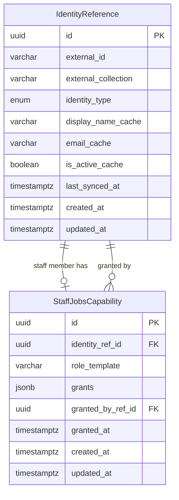
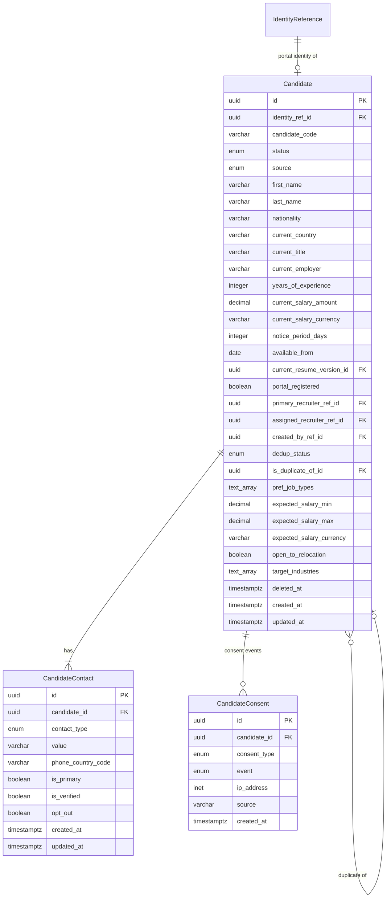
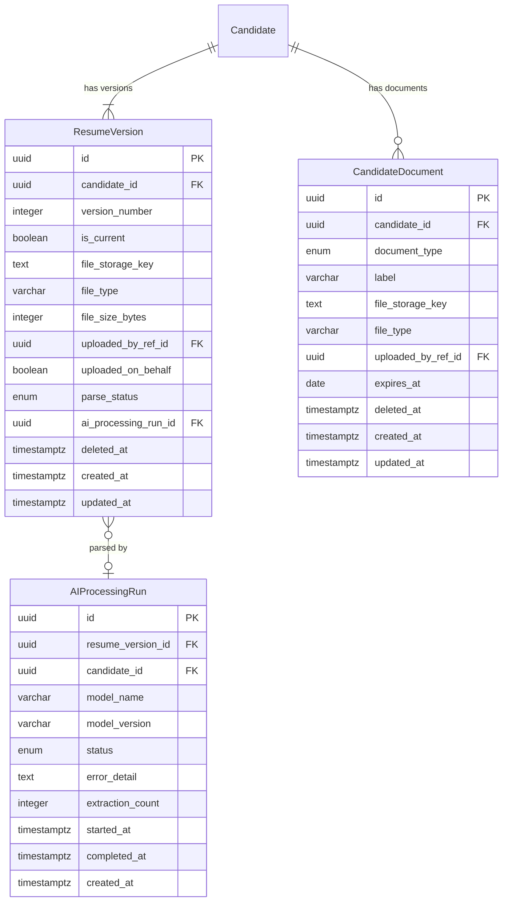
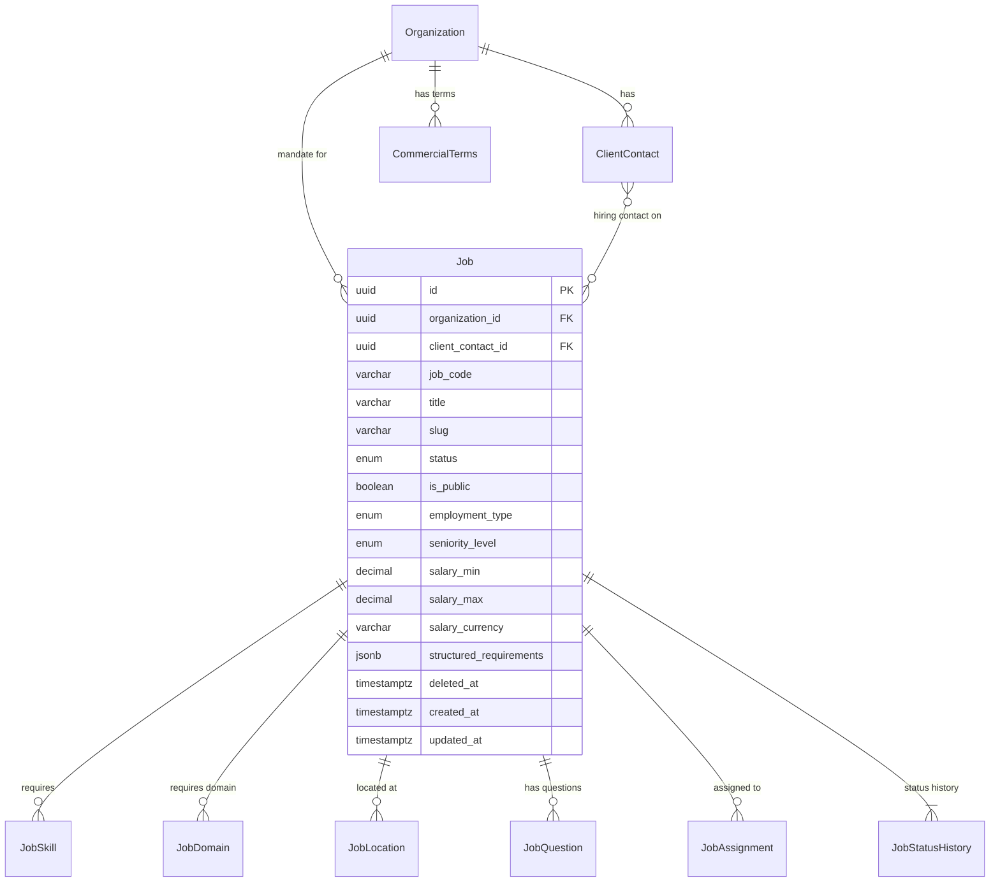
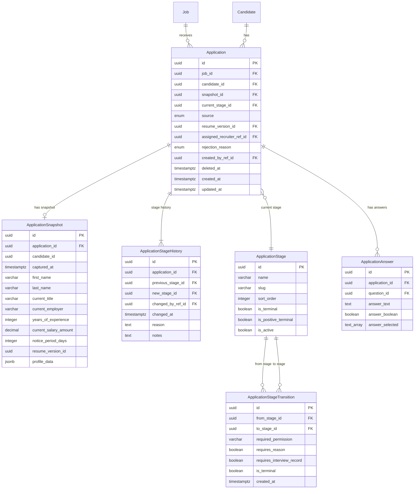
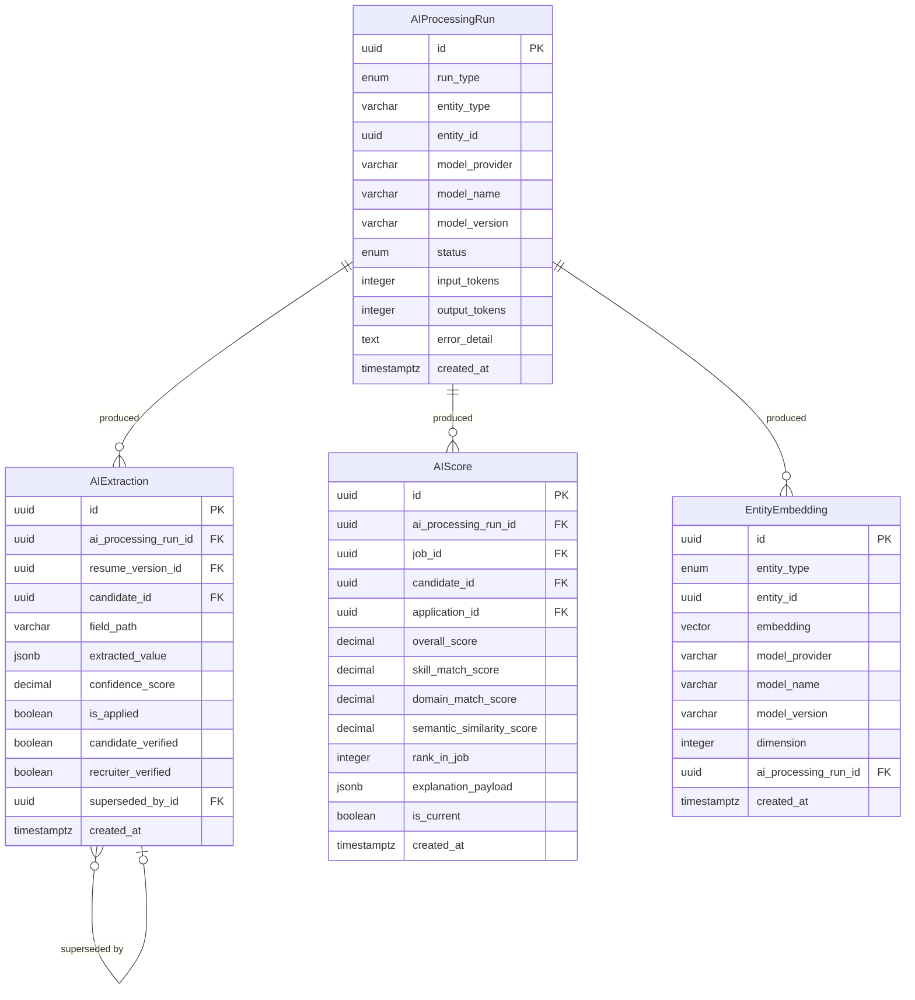

# Estabizz Jobs — Database ERD (Logical Data Model)

> **Document:** 03-DATABASE-ERD.md  
> **Phase:** 0D — Database Design  
> **Status:** Updated post-Codex review — superseded on conflicts by `05-ARCHITECTURE-FREEZE.md`  
> **Date:** 2026-08-08  
> **Preceding documents:** `00-CURRENT-SYSTEM-AUDIT.md`, `01-PRODUCT-SCOPE.md`, `02-SYSTEM-ARCHITECTURE.md`  
> **Freeze document:** `docs/jobs/05-ARCHITECTURE-FREEZE.md`  
> **Database:** PostgreSQL (Jobs domain only)  
> **ORM:** Prisma (not yet initialised — awaiting architecture freeze)

---

## 1. Design Principles

| Principle | Decision |
|---|---|
| **Primary keys** | UUID v4 for all Jobs-domain entities. Exception: `IdentityReference.external_id` stores MongoDB ObjectId as `String` (not a PK). |
| **Cross-database references** | No PostgreSQL foreign key points to MongoDB. All MongoDB identities enter via `IdentityReference`. |
| **Soft deletion** | All mutable entities use `deleted_at TIMESTAMPTZ` (nullable). A `NULL` value means the record is live. Hard deletion is never performed on candidate, job, application, organization, or placement data. |
| **Immutable records** | `AuditEvent`, `ApplicationStageHistory`, `JobStatusHistory`, `AIExtraction`, `AIProcessingRun`, and `ApplicationSnapshot` are append-only. They have no `deleted_at` and are never updated. |
| **Timestamps** | All entities have `created_at TIMESTAMPTZ NOT NULL DEFAULT NOW()` and `updated_at TIMESTAMPTZ NOT NULL DEFAULT NOW()`. Immutable records have `created_at` only. |
| **Actor references** | Any field recording "who did this" is a FK to `IdentityReference.id`, not to MongoDB. Stored as `actor_ref_id`, `created_by_ref_id`, etc. |
| **Ownership** | Candidates belong to the Estabizz Talent Database. No single recruiter owns a candidate permanently. Ownership fields (`primary_recruiter_ref_id`, `assigned_recruiter_ref_id`) are operational, not access-control primitives. |
| **Single operator** | No `tenant_id` column on V1 Jobs entities. Estabizz is the sole operator. Future multi-operator support would require a migration; it is not pre-scaffolded in V1. |
| **Enums** | Defined as PostgreSQL enum types or constrained `VARCHAR` columns with CHECK constraints. Decision deferred to Prisma schema authoring. |
| **Currency** | All monetary amounts use `DECIMAL(15,4)` paired with a `VARCHAR(3)` ISO 4217 currency code column. |
| **Country / locale** | All country fields use ISO 3166-1 alpha-2 `VARCHAR(2)`. Timezone uses IANA zone name. Phone country code is `VARCHAR(5)` (e.g., `'+91'`). |

---

## 2. V1 Entity Classification

Post-Codex reconciliation. This table is authoritative for Prisma schema authoring.

| Entity | V1 Classification | Notes |
|---|---|---|
| IdentityReference | **V1 PHYSICAL** | Cross-DB identity bridge |
| StaffJobsCapability | **V1 PHYSICAL** | JSONB grants; replaces TEXT[] |
| Candidate | **V1 PHYSICAL** | CandidatePreference columns merged in |
| CandidateContact | **V1 PHYSICAL** | |
| CandidatePreference | **MERGED** | Columns merged into Candidate |
| CandidateConsent | **V1 PHYSICAL** | Append-only events; no UNIQUE constraint |
| CandidateEmployment | **V1 PHYSICAL** | |
| CandidateEducation | **V1 PHYSICAL** | |
| CandidateCertification | **V1 PHYSICAL** | |
| Skill | **V1 PHYSICAL** | Master taxonomy |
| CandidateSkill | **V1 PHYSICAL** | |
| Domain | **V1 PHYSICAL** | Master taxonomy |
| CandidateDomainExperience | **V1 PHYSICAL** | |
| ResumeVersion | **V1 PHYSICAL** | |
| CandidateDocument | **V1 PHYSICAL** | |
| Tag | **V1 PHYSICAL** | |
| CandidateTag | **V1 PHYSICAL** | |
| CandidateActivity | **V1 PHYSICAL** | |
| Organization | **V1 PHYSICAL** | ClientRelationship fields merged in |
| ClientRelationship | **MERGED** | Fields merged into Organization |
| ClientContact | **V1 PHYSICAL** | |
| CommercialTerms | **V1 PHYSICAL** | FK changed to Organization |
| Job | **V1 PHYSICAL** | No tenant_id; no inline embedding; JobRequirement merged as JSONB |
| JobSkill | **V1 PHYSICAL** | |
| JobDomain | **V1 PHYSICAL** | |
| JobLocation | **V1 PHYSICAL** | |
| JobRequirement | **MERGED** | Merged into Job.structured_requirements JSONB |
| JobQuestion | **V1 PHYSICAL** | |
| JobAssignment | **V1 PHYSICAL** | |
| JobStatusHistory | **V1 PHYSICAL** | |
| ApplicationStage | **V1 PHYSICAL** | Config table |
| ApplicationStageTransition | **V1 PHYSICAL** | New — stage machine rules |
| Application | **V1 PHYSICAL** | ApplicationAssignment merged as single field |
| ApplicationSnapshot | **V1 PHYSICAL** | |
| ApplicationAnswer | **V1 PHYSICAL** | |
| ApplicationStageHistory | **V1 PHYSICAL** | |
| ApplicationAssignment | **MERGED** | Merged into Application.assigned_recruiter_ref_id |
| Interview | **V1 PHYSICAL** | InterviewFeedback merged in |
| InterviewParticipant | **V1 PHYSICAL** | |
| InterviewFeedback | **MERGED** | Columns merged into Interview |
| Offer | **V1 PHYSICAL** | |
| Placement | **V1 PHYSICAL** | PlacementFee + CommercialStatus merged in |
| PlacementFee | **MERGED** | Merged into Placement |
| CommercialStatus | **MERGED** | Merged into Placement |
| RecruitmentNote | **V1 PHYSICAL** | |
| Task | **V1 PHYSICAL** | |
| Communication | **V1 PHYSICAL** | |
| RecruitmentTeam | **DEFERRED** | V2 — requires team structure design |
| TeamMembership | **DEFERRED** | V2 — depends on RecruitmentTeam |
| AIProcessingRun | **V1 PHYSICAL** | |
| AIExtraction | **V1 PHYSICAL** | |
| AIScore | **V1 PHYSICAL** | AIMatchExplanation merged as explanation_payload JSONB |
| AIMatchExplanation | **MERGED** | Merged into AIScore.explanation_payload JSONB |
| EntityEmbedding | **V1 PHYSICAL** | New — replaces inline vector columns on Candidate/Job |
| AuditEvent | **V1 PHYSICAL** | |

**V1 Physical table count: 38**  
**Merged (eliminated): 8** (CandidatePreference, ClientRelationship, JobRequirement, ApplicationAssignment, InterviewFeedback, PlacementFee, CommercialStatus, AIMatchExplanation)  
**New in V1: 2** (ApplicationStageTransition, EntityEmbedding)  
**Deferred to V2: 2** (RecruitmentTeam, TeamMembership)

---

## 3. Entity Groups Overview (V1 Physical)

| Group | V1 Physical Entities | Merged / Deferred |
|---|---|---|
| 1. Identity | IdentityReference, StaffJobsCapability | — |
| 2. Candidate Core | Candidate (incl. preference cols), CandidateContact, CandidateConsent | ~~CandidatePreference~~ merged |
| 3. Candidate Profile | CandidateEmployment, CandidateEducation, CandidateCertification, Skill, CandidateSkill, Domain, CandidateDomainExperience | — |
| 4. Resume & Documents | ResumeVersion, CandidateDocument | — |
| 5. Tags & Activity | Tag, CandidateTag, CandidateActivity | — |
| 6. Organization & Client | Organization (incl. relationship fields), ClientContact, CommercialTerms | ~~ClientRelationship~~ merged |
| 7. Jobs | Job (incl. structured_requirements JSONB), JobSkill, JobDomain, JobLocation, JobQuestion, JobAssignment, JobStatusHistory | ~~JobRequirement~~ merged |
| 8. Applications | Application (incl. assigned_recruiter_ref_id), ApplicationSnapshot, ApplicationAnswer, ApplicationStage, ApplicationStageTransition, ApplicationStageHistory | ~~ApplicationAssignment~~ merged |
| 9. Interview, Offer, Placement | Interview (incl. feedback), InterviewParticipant, Offer, Placement (incl. fee + commercial) | ~~InterviewFeedback~~, ~~PlacementFee~~, ~~CommercialStatus~~ merged |
| 10. Operational | RecruitmentNote, Task, Communication | ~~RecruitmentTeam~~, ~~TeamMembership~~ deferred V2 |
| 11. AI | AIProcessingRun, AIExtraction, AIScore (incl. explanation JSONB), EntityEmbedding | ~~AIMatchExplanation~~ merged |
| 12. Audit | AuditEvent | — |

---

## 3. Group 1 — Identity Layer

### 3.1 Design Rationale

`IdentityReference` is the single point of entry for any MongoDB identity into the PostgreSQL Jobs domain. Every recruiter action, every candidate ownership field, every "created by" reference stores a `IdentityReference.id` UUID — never a MongoDB ObjectId string directly in a business entity.

This allows:
- All Jobs joins to stay within PostgreSQL (no cross-DB query)
- MongoDB User deletion or deactivation to be handled gracefully (the `IdentityReference` persists; cached name/email become the fallback)
- A consistent actor model across audit logs

### 3.2 Entity: IdentityReference

| Column | Type | Constraints | Notes |
|---|---|---|---|
| `id` | UUID | PK, NOT NULL, default gen_random_uuid() | Stable Jobs-domain identity |
| `external_id` | VARCHAR(24) | NOT NULL | MongoDB ObjectId as string |
| `external_collection` | VARCHAR(50) | NOT NULL | `'users'` or `'admin_users'` |
| `identity_type` | ENUM | NOT NULL | `'candidate_user'`, `'admin_user'`, `'system'` |
| `display_name_cache` | VARCHAR(200) | nullable | Denormalised from MongoDB; not authoritative |
| `email_cache` | VARCHAR(255) | nullable | Denormalised from MongoDB; not authoritative |
| `is_active_cache` | BOOLEAN | NOT NULL, default TRUE | Cached status; refreshed lazily |
| `last_synced_at` | TIMESTAMPTZ | nullable | When cache was last refreshed |
| `created_at` | TIMESTAMPTZ | NOT NULL, default NOW() | |
| `updated_at` | TIMESTAMPTZ | NOT NULL, default NOW() | |

**Constraint:** `UNIQUE (external_collection, external_id)` — composite uniqueness prevents collision across collections (a `users` ObjectId and an `admin_users` ObjectId that happen to share the same string must map to different rows).

### 3.3 Entity: StaffJobsCapability

Stores Jobs-specific permissions for Estabizz staff (AdminUsers). Independent of CMS `AdminUser.permissions[]` in MongoDB.

| Column | Type | Constraints | Notes |
|---|---|---|---|
| `id` | UUID | PK | |
| `identity_ref_id` | UUID | FK → IdentityReference, NOT NULL, UNIQUE | One row per staff member |
| `role_template` | VARCHAR(50) | nullable | Template name (e.g., `recruiter`) — informational only; not used in runtime checks |
| `grants` | JSONB | NOT NULL, default `[]` | Array of `{permission_code: string, scope: "OWN"\|"TEAM"\|"ALL"}` objects |
| `granted_by_ref_id` | UUID | FK → IdentityReference, nullable | Who granted these capabilities |
| `granted_at` | TIMESTAMPTZ | nullable | |
| `created_at` | TIMESTAMPTZ | NOT NULL | |
| `updated_at` | TIMESTAMPTZ | NOT NULL | |



---

## 4. Group 2 — Candidate Core

### 4.1 Design Rationale

`Candidate` is the master record. It is not a CV document. A candidate may exist without a portal account (recruiter-sourced) and without a current resume (manually entered). The `identity_ref_id` link to MongoDB `users` is optional until the candidate registers on the portal.

Candidate status covers the talent lifecycle, not the application lifecycle. Application status is tracked separately.

### 4.2 Entity: Candidate

| Column | Type | Constraints | Notes |
|---|---|---|---|
| `id` | UUID | PK | Stable, permanent Jobs identity |
| `identity_ref_id` | UUID | FK → IdentityReference, nullable, UNIQUE | Links to portal account; null for recruiter-sourced |
| `candidate_code` | VARCHAR(20) | NOT NULL, UNIQUE | Human-readable e.g. `EST-C-000001` |
| `status` | ENUM | NOT NULL | `active`, `passive`, `placed`, `on_notice`, `do_not_contact`, `blacklisted`, `archived` |
| `source` | ENUM | NOT NULL | `portal_registration`, `recruiter_sourced`, `referral`, `linkedin`, `job_board`, `career_fair`, `other` |
| `source_detail` | TEXT | nullable | Free-text source annotation |
| `first_name` | VARCHAR(100) | NOT NULL | |
| `last_name` | VARCHAR(100) | NOT NULL | |
| `preferred_name` | VARCHAR(100) | nullable | |
| `date_of_birth` | DATE | nullable | |
| `gender` | VARCHAR(50) | nullable | Not used in matching; demographic record only |
| `nationality` | VARCHAR(2) | nullable | ISO 3166-1 alpha-2 |
| `current_country` | VARCHAR(2) | nullable | ISO 3166-1 alpha-2 |
| `current_state` | VARCHAR(100) | nullable | |
| `current_city` | VARCHAR(100) | nullable | |
| `current_postal_code` | VARCHAR(20) | nullable | |
| `current_title` | VARCHAR(200) | nullable | Current job title |
| `current_employer` | VARCHAR(200) | nullable | Current employer name (denorm; full history in CandidateEmployment) |
| `years_of_experience` | INTEGER | nullable | Total professional experience |
| `current_salary_amount` | DECIMAL(15,4) | nullable | |
| `current_salary_currency` | VARCHAR(3) | nullable | ISO 4217 |
| `current_total_comp_amount` | DECIMAL(15,4) | nullable | Including bonus, ESOP, etc. |
| `current_total_comp_currency` | VARCHAR(3) | nullable | |
| `notice_period_days` | INTEGER | nullable | |
| `available_from` | DATE | nullable | |
| `work_authorization` | VARCHAR(50) | nullable | e.g. `'citizen'`, `'pr'`, `'work_visa'` |
| `remote_preference` | ENUM | nullable | `remote`, `hybrid`, `on_site`, `flexible` |
| `current_resume_version_id` | UUID | FK → ResumeVersion, nullable | Points to active resume version |
| `portal_registered` | BOOLEAN | NOT NULL, default FALSE | Has a portal account |
| `profile_completeness_pct` | SMALLINT | NOT NULL, default 0 | Computed field 0–100 |
| `primary_recruiter_ref_id` | UUID | FK → IdentityReference, nullable | Lead recruiter |
| `assigned_recruiter_ref_id` | UUID | FK → IdentityReference, nullable | Operational assignee |
| `assigned_team_id` | UUID | nullable | Reserved for V2 RecruitmentTeam — not a FK in V1 |
| `created_by_ref_id` | UUID | FK → IdentityReference, NOT NULL | |
| `last_contacted_by_ref_id` | UUID | FK → IdentityReference, nullable | |
| `last_contacted_at` | TIMESTAMPTZ | nullable | |
| `active_process_owner_ref_id` | UUID | FK → IdentityReference, nullable | Recruiter managing active process |
| `placement_credit_ref_id` | UUID | FK → IdentityReference, nullable | Recruiter credited for placement |
| `dedup_status` | ENUM | NOT NULL, default `unique` | `unique`, `suspected_duplicate`, `confirmed_duplicate`, `merged_into` |
| `is_duplicate_of_id` | UUID | FK → Candidate, nullable | Points to canonical record if merged |
| `internal_rating` | SMALLINT | nullable | 1–5 recruiter assessment |
| `pref_job_types` | TEXT[] | nullable | Preferred employment types e.g. `['full_time', 'contract']` |
| `pref_remote` | ENUM | nullable | `remote`, `hybrid`, `on_site`, `flexible` |
| `pref_countries` | VARCHAR(2)[] | nullable | ISO country codes |
| `pref_cities` | TEXT[] | nullable | |
| `expected_salary_min` | DECIMAL(15,4) | nullable | |
| `expected_salary_max` | DECIMAL(15,4) | nullable | |
| `expected_salary_currency` | VARCHAR(3) | nullable | |
| `open_to_relocation` | BOOLEAN | nullable | |
| `open_to_international` | BOOLEAN | nullable | |
| `target_industries` | TEXT[] | nullable | Domain / sector codes |
| `target_seniority` | TEXT[] | nullable | e.g. `['director', 'vp', 'md']` |
| `preference_notes` | TEXT | nullable | Free-text preference summary |
| `deleted_at` | TIMESTAMPTZ | nullable | Soft delete |
| `deleted_by_ref_id` | UUID | FK → IdentityReference, nullable | |
| `deleted_reason` | TEXT | nullable | |
| `created_at` | TIMESTAMPTZ | NOT NULL | |
| `updated_at` | TIMESTAMPTZ | NOT NULL | |

**Indexes:**
- `(status, created_at)` — pipeline queries
- `(current_country, current_city)` — location filter
- `(primary_recruiter_ref_id)` — recruiter workload
- `GIN (current_title, current_employer)` with `pg_trgm` — fuzzy text search
- `(dedup_status)` — deduplication queue

### 4.3 Entity: CandidateContact

Stores all contact methods. One may be marked primary per type.

| Column | Type | Constraints | Notes |
|---|---|---|---|
| `id` | UUID | PK | |
| `candidate_id` | UUID | FK → Candidate, NOT NULL | |
| `contact_type` | ENUM | NOT NULL | `email`, `phone_mobile`, `phone_work`, `linkedin`, `github`, `portfolio`, `other` |
| `value` | VARCHAR(500) | NOT NULL | Email address, phone number, URL |
| `phone_country_code` | VARCHAR(5) | nullable | e.g. `'+91'` |
| `is_primary` | BOOLEAN | NOT NULL, default FALSE | |
| `is_verified` | BOOLEAN | NOT NULL, default FALSE | |
| `verified_at` | TIMESTAMPTZ | nullable | |
| `opt_out` | BOOLEAN | NOT NULL, default FALSE | Do not contact via this method |
| `created_at` | TIMESTAMPTZ | NOT NULL | |
| `updated_at` | TIMESTAMPTZ | NOT NULL | |

**Constraint:** `UNIQUE (candidate_id, contact_type, value)`

### 4.4 ~~CandidatePreference~~ — MERGED INTO Candidate

`CandidatePreference` is eliminated as a separate table. Its columns (`pref_job_types`, `pref_remote`, `pref_countries`, `pref_cities`, `expected_salary_min/max/currency`, `open_to_relocation`, `open_to_international`, `target_industries`, `target_seniority`, `preference_notes`) are now columns on `Candidate` directly. The 1:1 join is unnecessary overhead in V1 given the small column count and single-row access pattern.

### 4.5 Entity: CandidateConsent

Append-only consent event log. Each grant or withdrawal is a **new row** — existing rows are never updated. The current consent state for a given `consent_type` is the most recent row ordered by `created_at`.

| Column | Type | Constraints | Notes |
|---|---|---|---|
| `id` | UUID | PK | |
| `candidate_id` | UUID | FK → Candidate, NOT NULL | |
| `consent_type` | ENUM | NOT NULL | `data_processing`, `marketing_email`, `data_retention_extended`, `profile_sharing_with_clients`, `ai_processing` |
| `event` | ENUM | NOT NULL | `granted`, `withdrawn` |
| `ip_address` | INET | nullable | At time of event |
| `user_agent` | TEXT | nullable | |
| `source` | VARCHAR(100) | nullable | `'portal_registration'`, `'recruiter_on_behalf'` |
| `created_at` | TIMESTAMPTZ | NOT NULL | Immutable — no updated_at |

**No UNIQUE constraint** — multiple rows per `(candidate_id, consent_type)` are expected. Current state is derived by querying the latest `event` value per `consent_type`.



---

## 5. Group 3 — Candidate Profile

### 5.1 Entity: CandidateEmployment

One row per employment position. Supports concurrent positions (multiple current employers).

| Column | Type | Constraints | Notes |
|---|---|---|---|
| `id` | UUID | PK | |
| `candidate_id` | UUID | FK → Candidate, NOT NULL | |
| `employer_name` | VARCHAR(300) | NOT NULL | |
| `employer_country` | VARCHAR(2) | nullable | ISO country code |
| `title` | VARCHAR(200) | NOT NULL | |
| `employment_type` | ENUM | nullable | `full_time`, `part_time`, `contract`, `consulting`, `internship` |
| `start_date` | DATE | NOT NULL | |
| `end_date` | DATE | nullable | NULL = current position |
| `is_current` | BOOLEAN | NOT NULL, default FALSE | |
| `description` | TEXT | nullable | |
| `location_city` | VARCHAR(100) | nullable | |
| `location_country` | VARCHAR(2) | nullable | |
| `salary_amount` | DECIMAL(15,4) | nullable | |
| `salary_currency` | VARCHAR(3) | nullable | |
| `ai_extracted` | BOOLEAN | NOT NULL, default FALSE | Whether sourced from AI parsing |
| `sort_order` | INTEGER | NOT NULL, default 0 | Display order |
| `created_at` | TIMESTAMPTZ | NOT NULL | |
| `updated_at` | TIMESTAMPTZ | NOT NULL | |

### 5.2 Entity: CandidateEducation

| Column | Type | Constraints | Notes |
|---|---|---|---|
| `id` | UUID | PK | |
| `candidate_id` | UUID | FK → Candidate, NOT NULL | |
| `institution_name` | VARCHAR(300) | NOT NULL | |
| `institution_country` | VARCHAR(2) | nullable | |
| `degree` | VARCHAR(200) | nullable | e.g. `MBA`, `B.Com`, `CA` |
| `field_of_study` | VARCHAR(200) | nullable | |
| `start_year` | SMALLINT | nullable | |
| `end_year` | SMALLINT | nullable | |
| `grade` | VARCHAR(50) | nullable | |
| `ai_extracted` | BOOLEAN | NOT NULL, default FALSE | |
| `created_at` | TIMESTAMPTZ | NOT NULL | |
| `updated_at` | TIMESTAMPTZ | NOT NULL | |

### 5.3 Entity: CandidateCertification

| Column | Type | Constraints | Notes |
|---|---|---|---|
| `id` | UUID | PK | |
| `candidate_id` | UUID | FK → Candidate, NOT NULL | |
| `certification_name` | VARCHAR(200) | NOT NULL | e.g. `CFA Level III`, `NISM Series VIII` |
| `issuing_body` | VARCHAR(200) | nullable | |
| `issued_date` | DATE | nullable | |
| `expiry_date` | DATE | nullable | |
| `license_number` | VARCHAR(100) | nullable | |
| `is_active` | BOOLEAN | NOT NULL, default TRUE | |
| `country` | VARCHAR(2) | nullable | |
| `ai_extracted` | BOOLEAN | NOT NULL, default FALSE | |
| `created_at` | TIMESTAMPTZ | NOT NULL | |
| `updated_at` | TIMESTAMPTZ | NOT NULL | |

### 5.4 Entity: Skill (Master)

Canonical skill taxonomy. Shared across candidates and jobs.

| Column | Type | Constraints | Notes |
|---|---|---|---|
| `id` | UUID | PK | |
| `name` | VARCHAR(200) | NOT NULL, UNIQUE | Normalised skill name |
| `slug` | VARCHAR(200) | NOT NULL, UNIQUE | URL-safe identifier |
| `category` | VARCHAR(100) | nullable | e.g. `regulatory`, `technical`, `soft_skill`, `financial` |
| `aliases` | TEXT[] | nullable | Alternative names for matching |
| `created_at` | TIMESTAMPTZ | NOT NULL | |
| `updated_at` | TIMESTAMPTZ | NOT NULL | |

### 5.5 Entity: CandidateSkill (Join)

| Column | Type | Constraints | Notes |
|---|---|---|---|
| `id` | UUID | PK | |
| `candidate_id` | UUID | FK → Candidate, NOT NULL | |
| `skill_id` | UUID | FK → Skill, NOT NULL | |
| `proficiency` | ENUM | nullable | `beginner`, `intermediate`, `advanced`, `expert` |
| `years_experience` | DECIMAL(4,1) | nullable | |
| `is_primary` | BOOLEAN | NOT NULL, default FALSE | Top skill flag |
| `ai_extracted` | BOOLEAN | NOT NULL, default FALSE | |
| `created_at` | TIMESTAMPTZ | NOT NULL | |
| `updated_at` | TIMESTAMPTZ | NOT NULL | |

**Constraint:** `UNIQUE (candidate_id, skill_id)`

### 5.6 Entity: Domain (Master)

Regulatory and sector domain taxonomy. Used for both candidate experience and job requirements.

| Column | Type | Constraints | Notes |
|---|---|---|---|
| `id` | UUID | PK | |
| `name` | VARCHAR(200) | NOT NULL, UNIQUE | e.g. `SEBI Capital Markets`, `RBI NBFC Regulations` |
| `slug` | VARCHAR(200) | NOT NULL, UNIQUE | |
| `regulator` | VARCHAR(100) | nullable | `RBI`, `SEBI`, `IRDAI`, `IFSCA`, `FIU-IND`, `MCA` |
| `sector` | VARCHAR(100) | nullable | `banking`, `capital_markets`, `insurance`, `fintech`, `technology` |
| `parent_domain_id` | UUID | FK → Domain, nullable | Hierarchy support |
| `description` | TEXT | nullable | |
| `created_at` | TIMESTAMPTZ | NOT NULL | |
| `updated_at` | TIMESTAMPTZ | NOT NULL | |

### 5.7 Entity: CandidateDomainExperience (Join)

| Column | Type | Constraints | Notes |
|---|---|---|---|
| `id` | UUID | PK | |
| `candidate_id` | UUID | FK → Candidate, NOT NULL | |
| `domain_id` | UUID | FK → Domain, NOT NULL | |
| `years_experience` | DECIMAL(4,1) | nullable | |
| `proficiency` | ENUM | nullable | `aware`, `working`, `practitioner`, `expert` |
| `notes` | TEXT | nullable | |
| `ai_extracted` | BOOLEAN | NOT NULL, default FALSE | |
| `created_at` | TIMESTAMPTZ | NOT NULL | |
| `updated_at` | TIMESTAMPTZ | NOT NULL | |

**Constraint:** `UNIQUE (candidate_id, domain_id)`

---

## 6. Group 4 — Resume and Documents

### 6.1 Resume Versioning Design

A candidate may upload multiple CVs over time. The system retains all versions. `Candidate.current_resume_version_id` always points to the active resume. When a new resume is uploaded:
1. New `ResumeVersion` row created with `is_current = true`
2. Previous `ResumeVersion` row updated: `is_current = false`
3. `Candidate.current_resume_version_id` updated to new version
4. `AIProcessingRun` queued for the new version

**Important:** Previous versions are never deleted. They remain accessible for audit and for historical application snapshots that referenced the old version.

### 6.2 Entity: ResumeVersion

| Column | Type | Constraints | Notes |
|---|---|---|---|
| `id` | UUID | PK | |
| `candidate_id` | UUID | FK → Candidate, NOT NULL | |
| `version_number` | INTEGER | NOT NULL | Monotonically increasing per candidate |
| `is_current` | BOOLEAN | NOT NULL, default TRUE | Only one TRUE per candidate |
| `file_storage_key` | TEXT | NOT NULL | Object storage key (e.g., `candidates/{candidate_id}/resumes/{uuid}.pdf`) |
| `file_name_original` | VARCHAR(500) | NOT NULL | As uploaded by candidate |
| `file_type` | VARCHAR(50) | NOT NULL | `pdf`, `docx`, `doc` |
| `file_size_bytes` | INTEGER | NOT NULL | |
| `uploaded_by_ref_id` | UUID | FK → IdentityReference, NOT NULL | Candidate or recruiter |
| `uploaded_on_behalf` | BOOLEAN | NOT NULL, default FALSE | Recruiter uploaded on behalf of candidate |
| `parse_status` | ENUM | NOT NULL, default `pending` | `pending`, `processing`, `completed`, `failed` |
| `parse_completed_at` | TIMESTAMPTZ | nullable | |
| `ai_processing_run_id` | UUID | FK → AIProcessingRun, nullable | Latest parse run |
| `deleted_at` | TIMESTAMPTZ | nullable | Soft archive only; never permanent |
| `created_at` | TIMESTAMPTZ | NOT NULL | |
| `updated_at` | TIMESTAMPTZ | NOT NULL | |

**Constraint:** Partial unique index: `UNIQUE (candidate_id) WHERE is_current = true` — only one current resume per candidate.

### 6.3 Entity: CandidateDocument

Non-resume documents (ID proof, certificates, offer letters, reference letters).

| Column | Type | Constraints | Notes |
|---|---|---|---|
| `id` | UUID | PK | |
| `candidate_id` | UUID | FK → Candidate, NOT NULL | |
| `document_type` | ENUM | NOT NULL | `id_proof`, `certificate`, `offer_letter`, `reference_letter`, `other` |
| `label` | VARCHAR(200) | NOT NULL | Human-readable name |
| `file_storage_key` | TEXT | NOT NULL | |
| `file_name_original` | VARCHAR(500) | NOT NULL | |
| `file_type` | VARCHAR(50) | NOT NULL | |
| `file_size_bytes` | INTEGER | NOT NULL | |
| `uploaded_by_ref_id` | UUID | FK → IdentityReference, NOT NULL | |
| `expires_at` | DATE | nullable | Document expiry |
| `deleted_at` | TIMESTAMPTZ | nullable | Soft delete |
| `created_at` | TIMESTAMPTZ | NOT NULL | |
| `updated_at` | TIMESTAMPTZ | NOT NULL | |



---

## 7. Group 5 — Tags and Activity

### 7.1 Entity: Tag (Master)

| Column | Type | Constraints | Notes |
|---|---|---|---|
| `id` | UUID | PK | |
| `name` | VARCHAR(100) | NOT NULL, UNIQUE | |
| `slug` | VARCHAR(100) | NOT NULL, UNIQUE | |
| `tag_type` | ENUM | NOT NULL | `candidate`, `job`, `system` |
| `colour_hex` | VARCHAR(7) | nullable | UI display |
| `created_by_ref_id` | UUID | FK → IdentityReference | |
| `created_at` | TIMESTAMPTZ | NOT NULL | |

### 7.2 Entity: CandidateTag (Join)

| Column | Type | Constraints | Notes |
|---|---|---|---|
| `id` | UUID | PK | |
| `candidate_id` | UUID | FK → Candidate, NOT NULL | |
| `tag_id` | UUID | FK → Tag, NOT NULL | |
| `tagged_by_ref_id` | UUID | FK → IdentityReference, NOT NULL | |
| `created_at` | TIMESTAMPTZ | NOT NULL | |

**Constraint:** `UNIQUE (candidate_id, tag_id)`

### 7.3 Entity: CandidateActivity

Timeline of all significant interactions with a candidate. Append-only. Distinct from `AuditEvent` — activity is recruiter-facing CRM context; audit is compliance context.

| Column | Type | Constraints | Notes |
|---|---|---|---|
| `id` | UUID | PK | |
| `candidate_id` | UUID | FK → Candidate, NOT NULL | |
| `activity_type` | ENUM | NOT NULL | `profile_created`, `resume_uploaded`, `application_submitted`, `stage_changed`, `note_added`, `email_sent`, `call_logged`, `interview_scheduled`, `offer_extended`, `placed`, `contacted` |
| `description` | TEXT | nullable | Human-readable summary |
| `actor_ref_id` | UUID | FK → IdentityReference, NOT NULL | |
| `related_entity_type` | VARCHAR(50) | nullable | `application`, `job`, `interview`, `offer` |
| `related_entity_id` | UUID | nullable | Entity this activity concerns |
| `created_at` | TIMESTAMPTZ | NOT NULL | Immutable — never updated |

---

## 8. Group 6 — Organization and Client

### 8.1 Design: Employer Portal Future-Readiness

In Version 1, `Organization` represents Estabizz's client. No employer login exists. The schema is designed so Version 2 can attach an employer authentication identity to `Organization` by adding an `employer_user_id` column (FK to a future employer identity table) without restructuring any existing relationships.

### 8.2 Entity: Organization

`ClientRelationship` is eliminated as a separate table. V1 assumes one active commercial relationship type per organization; relationship fields are inlined directly on `Organization`.

| Column | Type | Constraints | Notes |
|---|---|---|---|
| `id` | UUID | PK | |
| `legal_name` | VARCHAR(300) | NOT NULL | Registered legal name |
| `display_name` | VARCHAR(300) | nullable | Trading name |
| `website` | VARCHAR(500) | nullable | |
| `industry` | VARCHAR(100) | nullable | Sector classification |
| `size_range` | ENUM | nullable | `1_10`, `11_50`, `51_200`, `201_1000`, `1000_plus` |
| `hq_country` | VARCHAR(2) | nullable | ISO country code |
| `hq_city` | VARCHAR(100) | nullable | |
| `description` | TEXT | nullable | |
| `logo_url` | TEXT | nullable | Cloudinary public URL (marketing image only) |
| `status` | ENUM | NOT NULL, default `active` | `active`, `inactive`, `do_not_approach` |
| `relationship_type` | ENUM | nullable | `retained`, `contingency`, `exclusive`, `preferred_supplier` |
| `relationship_status` | ENUM | NOT NULL, default `active` | `active`, `on_hold`, `closed` |
| `relationship_start_date` | DATE | nullable | |
| `account_owner_ref_id` | UUID | FK → IdentityReference, nullable | Estabizz account owner |
| `account_manager_ref_id` | UUID | FK → IdentityReference, nullable | Day-to-day account manager |
| `relationship_notes` | TEXT | nullable | |
| `created_by_ref_id` | UUID | FK → IdentityReference, NOT NULL | |
| `deleted_at` | TIMESTAMPTZ | nullable | |
| `created_at` | TIMESTAMPTZ | NOT NULL | |
| `updated_at` | TIMESTAMPTZ | NOT NULL | |

### 8.3 ~~ClientRelationship~~ — MERGED INTO Organization

`ClientRelationship` is eliminated. Its fields (`relationship_type`, `relationship_status`, `account_manager_ref_id`, `relationship_start_date`, `relationship_notes`) are now columns on `Organization`. V1 has at most one active commercial relationship type per client — the separate join table is unnecessary overhead.

If V2 requires multiple relationship records per organization (e.g., different business units), a `ClientRelationship` child table can be reintroduced without breaking the Organization schema.

### 8.4 Entity: ClientContact

A named contact at the client organization. No login in V1.

| Column | Type | Constraints | Notes |
|---|---|---|---|
| `id` | UUID | PK | |
| `organization_id` | UUID | FK → Organization, NOT NULL | |
| `first_name` | VARCHAR(100) | NOT NULL | |
| `last_name` | VARCHAR(100) | NOT NULL | |
| `title` | VARCHAR(200) | nullable | Job title at client |
| `email` | VARCHAR(255) | nullable | |
| `phone` | VARCHAR(50) | nullable | |
| `phone_country_code` | VARCHAR(5) | nullable | |
| `linkedin` | VARCHAR(500) | nullable | |
| `is_primary` | BOOLEAN | NOT NULL, default FALSE | Primary hiring contact |
| `is_active` | BOOLEAN | NOT NULL, default TRUE | |
| `notes` | TEXT | nullable | |
| `created_by_ref_id` | UUID | FK → IdentityReference, NOT NULL | |
| `created_at` | TIMESTAMPTZ | NOT NULL | |
| `updated_at` | TIMESTAMPTZ | NOT NULL | |

### 8.5 Entity: CommercialTerms

Fee structure agreed with a client relationship. Referenced when calculating placement fees.

| Column | Type | Constraints | Notes |
|---|---|---|---|
| `id` | UUID | PK | |
| `organization_id` | UUID | FK → Organization, NOT NULL | Direct FK since ClientRelationship is merged |
| `fee_type` | ENUM | NOT NULL | `percentage_ctc`, `fixed_fee`, `retainer_plus_success`, `milestone` |
| `fee_percentage` | DECIMAL(5,2) | nullable | e.g. `8.33` for 8.33% |
| `fee_fixed_amount` | DECIMAL(15,4) | nullable | |
| `fee_currency` | VARCHAR(3) | nullable | |
| `retainer_amount` | DECIMAL(15,4) | nullable | |
| `payment_terms_days` | INTEGER | nullable | Net 30, Net 60, etc. |
| `replacement_guarantee_days` | INTEGER | nullable | |
| `notes` | TEXT | nullable | |
| `effective_from` | DATE | NOT NULL | |
| `effective_to` | DATE | nullable | NULL = currently active |
| `created_by_ref_id` | UUID | FK → IdentityReference, NOT NULL | |
| `created_at` | TIMESTAMPTZ | NOT NULL | |
| `updated_at` | TIMESTAMPTZ | NOT NULL | |

---

## 9. Group 7 — Jobs

### 9.1 Entity: Job

| Column | Type | Constraints | Notes |
|---|---|---|---|
| `id` | UUID | PK | |
| `job_code` | VARCHAR(20) | NOT NULL, UNIQUE | e.g. `EST-J-000001` |
| `title` | VARCHAR(300) | NOT NULL | |
| `slug` | VARCHAR(300) | NOT NULL, UNIQUE | URL-safe, for public careers page |
| `organization_id` | UUID | FK → Organization, nullable | Client mandate |
| `client_contact_id` | UUID | FK → ClientContact, nullable | Hiring manager at client |
| `description` | TEXT | NOT NULL | Rich text (HTML) |
| `internal_notes` | TEXT | nullable | Recruiter-only context |
| `status` | ENUM | NOT NULL, default `draft` | `draft`, `open`, `on_hold`, `closed`, `filled`, `cancelled` |
| `is_public` | BOOLEAN | NOT NULL, default FALSE | Whether visible on careers page |
| `employment_type` | ENUM | nullable | `permanent`, `contract`, `consulting`, `fixed_term` |
| `seniority_level` | ENUM | nullable | `junior`, `mid`, `senior`, `lead`, `director`, `vp`, `c_suite` |
| `min_years_experience` | INTEGER | nullable | |
| `max_years_experience` | INTEGER | nullable | |
| `salary_min` | DECIMAL(15,4) | nullable | |
| `salary_max` | DECIMAL(15,4) | nullable | |
| `salary_currency` | VARCHAR(3) | nullable | |
| `salary_disclosed` | BOOLEAN | NOT NULL, default FALSE | Show range publicly |
| `remote_policy` | ENUM | nullable | `remote`, `hybrid`, `on_site` |
| `published_at` | TIMESTAMPTZ | nullable | |
| `closes_at` | DATE | nullable | |
| `positions_count` | SMALLINT | NOT NULL, default 1 | Number of open positions |
| `positions_filled` | SMALLINT | NOT NULL, default 0 | |
| `priority` | ENUM | NOT NULL, default `normal` | `low`, `normal`, `high`, `urgent` |
| `created_by_ref_id` | UUID | FK → IdentityReference, NOT NULL | |
| `structured_requirements` | JSONB | nullable | Merged from JobRequirement: `[{type, label, value, is_required}]` e.g. regulatory licences, language requirements |
| `approved_by_ref_id` | UUID | FK → IdentityReference, nullable | |
| `approved_at` | TIMESTAMPTZ | nullable | |
| `deleted_at` | TIMESTAMPTZ | nullable | |
| `created_at` | TIMESTAMPTZ | NOT NULL | |
| `updated_at` | TIMESTAMPTZ | NOT NULL | |

**Indexes:**
- `(status, is_public)` — public listing queries
- `(organization_id, status)` — client job queries
- `GIN (structured_requirements)` — JSONB queries on requirement types

### 9.2 Entity: JobSkill (Join)

| Column | Type | Constraints | Notes |
|---|---|---|---|
| `id` | UUID | PK | |
| `job_id` | UUID | FK → Job, NOT NULL | |
| `skill_id` | UUID | FK → Skill, NOT NULL | |
| `is_required` | BOOLEAN | NOT NULL, default TRUE | Required vs. preferred |
| `proficiency` | ENUM | nullable | Minimum expected level |
| `created_at` | TIMESTAMPTZ | NOT NULL | |

**Constraint:** `UNIQUE (job_id, skill_id)`

### 9.3 Entity: JobDomain (Join)

| Column | Type | Constraints | Notes |
|---|---|---|---|
| `id` | UUID | PK | |
| `job_id` | UUID | FK → Job, NOT NULL | |
| `domain_id` | UUID | FK → Domain, NOT NULL | |
| `is_required` | BOOLEAN | NOT NULL, default TRUE | |
| `min_years` | DECIMAL(4,1) | nullable | |
| `created_at` | TIMESTAMPTZ | NOT NULL | |

**Constraint:** `UNIQUE (job_id, domain_id)`

### 9.4 Entity: JobLocation

A job may be based in multiple locations (e.g., Mumbai or Bangalore).

| Column | Type | Constraints | Notes |
|---|---|---|---|
| `id` | UUID | PK | |
| `job_id` | UUID | FK → Job, NOT NULL | |
| `country` | VARCHAR(2) | NOT NULL | ISO code |
| `state` | VARCHAR(100) | nullable | |
| `city` | VARCHAR(100) | nullable | |
| `is_primary` | BOOLEAN | NOT NULL, default FALSE | |
| `created_at` | TIMESTAMPTZ | NOT NULL | |

### 9.5 ~~JobRequirement~~ — MERGED INTO Job

`JobRequirement` is eliminated as a separate table. Requirements are stored as `Job.structured_requirements JSONB` — an array of `{type, label, value, is_required}` objects. Each entry covers a regulatory licence, language requirement, clearance, or other non-Skill/Domain requirement.

This is sufficient for V1 query patterns. If individual requirements need indexing or matching beyond GIN queries, a separate table can be reintroduced without changing the Job schema.

### 9.6 Entity: JobQuestion

Screening questions asked at application time.

| Column | Type | Constraints | Notes |
|---|---|---|---|
| `id` | UUID | PK | |
| `job_id` | UUID | FK → Job, NOT NULL | |
| `question_text` | TEXT | NOT NULL | |
| `question_type` | ENUM | NOT NULL | `text`, `yes_no`, `multiple_choice`, `scale` |
| `options` | TEXT[] | nullable | For multiple_choice |
| `is_required` | BOOLEAN | NOT NULL, default TRUE | |
| `sort_order` | INTEGER | NOT NULL, default 0 | |
| `created_at` | TIMESTAMPTZ | NOT NULL | |
| `updated_at` | TIMESTAMPTZ | NOT NULL | |

### 9.7 Entity: JobAssignment

Which recruiter(s) are working on this job.

| Column | Type | Constraints | Notes |
|---|---|---|---|
| `id` | UUID | PK | |
| `job_id` | UUID | FK → Job, NOT NULL | |
| `recruiter_ref_id` | UUID | FK → IdentityReference, NOT NULL | |
| `role` | ENUM | NOT NULL | `lead_recruiter`, `supporting_recruiter`, `coordinator` |
| `assigned_by_ref_id` | UUID | FK → IdentityReference, NOT NULL | |
| `assigned_at` | TIMESTAMPTZ | NOT NULL | |
| `removed_at` | TIMESTAMPTZ | nullable | Soft remove |

**Constraint:** `UNIQUE (job_id, recruiter_ref_id) WHERE removed_at IS NULL`

### 9.8 Entity: JobStatusHistory

Immutable log of every job status transition.

| Column | Type | Constraints | Notes |
|---|---|---|---|
| `id` | UUID | PK | |
| `job_id` | UUID | FK → Job, NOT NULL | |
| `previous_status` | ENUM | nullable | NULL for initial status |
| `new_status` | ENUM | NOT NULL | |
| `changed_by_ref_id` | UUID | FK → IdentityReference, NOT NULL | |
| `reason` | TEXT | nullable | |
| `created_at` | TIMESTAMPTZ | NOT NULL | Immutable |



---

## 10. Group 8 — Applications

### 10.1 Application Snapshot Design

A candidate's master profile evolves over time. When a candidate applies (or is submitted by a recruiter), the system captures an **immutable snapshot** of the relevant profile fields at that moment.

- `ApplicationSnapshot` is created once, at application time
- It is never updated — even if the candidate later edits their profile
- It preserves: name, contact, current title, employer, years of experience, current salary, notice period, resume version ID, and a JSON `profile_data` blob of the full profile at submission time
- AI scores reference the snapshot, not the live profile
- Recruiters can compare the live profile against the snapshot via the ATS

### 10.2 Application Stage Design

Application stages follow a configurable pipeline. The `ApplicationStage` table defines the stages available (allowing Estabizz to customise pipeline stages in settings). The `Application.current_stage_id` points to the active stage. `ApplicationStageHistory` records every transition immutably.

**Default stages (V1):**
```
New → Screening → Shortlisted → Client Submitted → Interview Scheduled →
Interview Completed → Offer Extended → Offer Accepted → Placed →
Rejected → Withdrawn
```

### 10.3 Entity: ApplicationStageTransition (New — State Machine Config)

Defines the allowed directed edges in the application stage state machine. Seeded at deployment; not user-editable in V1. Every permitted movement from one existing stage to another must have a row here — transitions without a matching row are rejected by the API.

Initial application-stage assignment happens when the `Application` is created by setting `Application.current_stage_id`. It is not represented as an `ApplicationStageTransition` row, so no initial-stage transition row is required.

| Column | Type | Constraints | Notes |
|---|---|---|---|
| `id` | UUID | PK | |
| `from_stage_id` | UUID | FK → ApplicationStage, NOT NULL | Existing stage before the movement |
| `to_stage_id` | UUID | FK → ApplicationStage, NOT NULL | |
| `required_permission` | VARCHAR(100) | NOT NULL | e.g. `applications.change_stage` |
| `requires_reason` | BOOLEAN | NOT NULL, default FALSE | Written reason mandatory |
| `requires_interview_record` | BOOLEAN | NOT NULL, default FALSE | Interview row must exist |
| `is_terminal` | BOOLEAN | NOT NULL, default FALSE | Whether `to_stage` ends the pipeline |
| `created_at` | TIMESTAMPTZ | NOT NULL | |

**Constraint:** `UNIQUE (from_stage_id, to_stage_id)`

### 10.4 Entity: ApplicationStage (Configuration)

| Column | Type | Constraints | Notes |
|---|---|---|---|
| `id` | UUID | PK | |
| `name` | VARCHAR(100) | NOT NULL, UNIQUE | |
| `slug` | VARCHAR(100) | NOT NULL, UNIQUE | |
| `sort_order` | INTEGER | NOT NULL | Pipeline position |
| `is_terminal` | BOOLEAN | NOT NULL, default FALSE | Rejected, Withdrawn, Placed |
| `is_positive_terminal` | BOOLEAN | NOT NULL, default FALSE | Placed = true; Rejected = false |
| `is_active` | BOOLEAN | NOT NULL, default TRUE | |
| `colour_hex` | VARCHAR(7) | nullable | |
| `created_at` | TIMESTAMPTZ | NOT NULL | |

### 10.5 Entity: Application

| Column | Type | Constraints | Notes |
|---|---|---|---|
| `id` | UUID | PK | |
| `job_id` | UUID | FK → Job, NOT NULL | |
| `candidate_id` | UUID | FK → Candidate, NOT NULL | |
| `snapshot_id` | UUID | FK → ApplicationSnapshot, nullable | Set immediately after creation |
| `current_stage_id` | UUID | FK → ApplicationStage, NOT NULL | |
| `source` | ENUM | NOT NULL | `candidate_portal`, `recruiter_assigned`, `referral`, `imported` |
| `resume_version_id` | UUID | FK → ResumeVersion, nullable | Resume used for this application |
| `assigned_recruiter_ref_id` | UUID | FK → IdentityReference, nullable | Recruiter managing this application (merged from ApplicationAssignment) |
| `recruiter_notes` | TEXT | nullable | Initial recruiter notes |
| `rejection_reason` | ENUM | nullable | `not_suitable`, `candidate_withdrew`, `client_declined`, `role_cancelled`, `duplicate` |
| `rejection_detail` | TEXT | nullable | |
| `rejected_by_ref_id` | UUID | FK → IdentityReference, nullable | |
| `rejected_at` | TIMESTAMPTZ | nullable | |
| `created_by_ref_id` | UUID | FK → IdentityReference, NOT NULL | |
| `deleted_at` | TIMESTAMPTZ | nullable | Soft delete |
| `created_at` | TIMESTAMPTZ | NOT NULL | |
| `updated_at` | TIMESTAMPTZ | NOT NULL | |

**Constraint:** `UNIQUE (job_id, candidate_id) WHERE deleted_at IS NULL` — one active application per candidate per job.

### 10.6 Entity: ApplicationSnapshot

Immutable. Created once at application time.

| Column | Type | Constraints | Notes |
|---|---|---|---|
| `id` | UUID | PK | |
| `application_id` | UUID | FK → Application, NOT NULL, UNIQUE | 1:1 |
| `candidate_id` | UUID | NOT NULL | Denorm (not FK — snapshot is independent) |
| `captured_at` | TIMESTAMPTZ | NOT NULL | Time of snapshot |
| `first_name` | VARCHAR(100) | NOT NULL | |
| `last_name` | VARCHAR(100) | NOT NULL | |
| `current_title` | VARCHAR(200) | nullable | |
| `current_employer` | VARCHAR(200) | nullable | |
| `years_of_experience` | INTEGER | nullable | |
| `current_salary_amount` | DECIMAL(15,4) | nullable | |
| `current_salary_currency` | VARCHAR(3) | nullable | |
| `notice_period_days` | INTEGER | nullable | |
| `resume_version_id` | UUID | nullable | Which resume was current at time of application |
| `profile_data` | JSONB | NOT NULL | Full profile JSON at snapshot time |

### 10.7 Entity: ApplicationAnswer

Candidate's answers to job screening questions.

| Column | Type | Constraints | Notes |
|---|---|---|---|
| `id` | UUID | PK | |
| `application_id` | UUID | FK → Application, NOT NULL | |
| `question_id` | UUID | FK → JobQuestion, NOT NULL | |
| `answer_text` | TEXT | nullable | |
| `answer_boolean` | BOOLEAN | nullable | For yes_no questions |
| `answer_selected` | TEXT[] | nullable | For multiple_choice |
| `answer_scale` | SMALLINT | nullable | For scale questions |
| `created_at` | TIMESTAMPTZ | NOT NULL | |

**Constraint:** `UNIQUE (application_id, question_id)`

### 10.8 Entity: ApplicationStageHistory

Immutable. One row per initial stage assignment or later stage movement. Initial assignment may use `previous_stage_id = NULL`; configured transitions still require a non-null `ApplicationStageTransition.from_stage_id`.

| Column | Type | Constraints | Notes |
|---|---|---|---|
| `id` | UUID | PK | |
| `application_id` | UUID | FK → Application, NOT NULL | |
| `previous_stage_id` | UUID | FK → ApplicationStage, nullable | NULL for initial stage set |
| `new_stage_id` | UUID | FK → ApplicationStage, NOT NULL | |
| `changed_by_ref_id` | UUID | FK → IdentityReference, NOT NULL | |
| `changed_at` | TIMESTAMPTZ | NOT NULL | Immutable |
| `reason` | TEXT | nullable | |
| `notes` | TEXT | nullable | |

### 10.9 ~~ApplicationAssignment~~ — MERGED INTO Application

`ApplicationAssignment` is eliminated. A single `Application.assigned_recruiter_ref_id UUID FK → IdentityReference` column replaces it. V1 supports one assigned recruiter per application at a time. If V2 requires multi-recruiter assignment with role tracking, a dedicated assignment table can be reintroduced.



---

## 11. Group 9 — Interview, Offer, Placement

### 11.1 Entity: Interview

| Column | Type | Constraints | Notes |
|---|---|---|---|
| `id` | UUID | PK | |
| `application_id` | UUID | FK → Application, NOT NULL | |
| `interview_type` | ENUM | NOT NULL | `phone_screen`, `video_call`, `in_person`, `panel`, `technical`, `hr`, `final` |
| `round_number` | SMALLINT | NOT NULL, default 1 | |
| `status` | ENUM | NOT NULL, default `scheduled` | `scheduled`, `completed`, `cancelled`, `no_show` |
| `scheduled_at` | TIMESTAMPTZ | nullable | |
| `duration_minutes` | SMALLINT | nullable | |
| `location_or_link` | TEXT | nullable | Address or meeting URL |
| `format` | ENUM | nullable | `in_person`, `video`, `phone` |
| `notes` | TEXT | nullable | Pre-interview briefing |
| `outcome` | ENUM | nullable | `advance`, `reject`, `hold`, `offer` |
| `outcome_notes` | TEXT | nullable | |
| `feedback_overall_rating` | SMALLINT | nullable | 1–5 (merged from InterviewFeedback) |
| `feedback_technical_rating` | SMALLINT | nullable | |
| `feedback_communication_rating` | SMALLINT | nullable | |
| `feedback_culture_fit_rating` | SMALLINT | nullable | |
| `feedback_strengths` | TEXT | nullable | |
| `feedback_concerns` | TEXT | nullable | |
| `feedback_recommendation` | ENUM | nullable | `advance`, `reject`, `consider_another_role` |
| `feedback_submitted_by_ref_id` | UUID | FK → IdentityReference, nullable | Recruiter recording feedback |
| `feedback_submitted_at` | TIMESTAMPTZ | nullable | |
| `created_by_ref_id` | UUID | FK → IdentityReference, NOT NULL | |
| `deleted_at` | TIMESTAMPTZ | nullable | |
| `created_at` | TIMESTAMPTZ | NOT NULL | |
| `updated_at` | TIMESTAMPTZ | NOT NULL | |

### 11.2 Entity: InterviewParticipant

| Column | Type | Constraints | Notes |
|---|---|---|---|
| `id` | UUID | PK | |
| `interview_id` | UUID | FK → Interview, NOT NULL | |
| `participant_type` | ENUM | NOT NULL | `candidate`, `estabizz_recruiter`, `client_interviewer` |
| `identity_ref_id` | UUID | FK → IdentityReference, nullable | For Estabizz staff |
| `client_contact_id` | UUID | FK → ClientContact, nullable | For client-side participants |
| `external_name` | VARCHAR(200) | nullable | For ad-hoc participants |
| `external_email` | VARCHAR(255) | nullable | |
| `confirmed` | BOOLEAN | NOT NULL, default FALSE | |
| `created_at` | TIMESTAMPTZ | NOT NULL | |

### 11.3 ~~InterviewFeedback~~ — MERGED INTO Interview

`InterviewFeedback` is eliminated. Rating and feedback columns (`feedback_overall_rating`, `feedback_technical_rating`, `feedback_communication_rating`, `feedback_culture_fit_rating`, `feedback_strengths`, `feedback_concerns`, `feedback_recommendation`, `feedback_submitted_by_ref_id`, `feedback_submitted_at`) are now columns on `Interview`. Since there is only ever one feedback record per interview in V1 (recorded by the Estabizz recruiter), the 1:1 join is unnecessary overhead.

### 11.4 Entity: Offer

| Column | Type | Constraints | Notes |
|---|---|---|---|
| `id` | UUID | PK | |
| `application_id` | UUID | FK → Application, NOT NULL | |
| `status` | ENUM | NOT NULL, default `draft` | `draft`, `extended`, `accepted`, `declined`, `rescinded`, `expired` |
| `offered_salary_amount` | DECIMAL(15,4) | nullable | |
| `offered_salary_currency` | VARCHAR(3) | nullable | |
| `offered_total_comp_amount` | DECIMAL(15,4) | nullable | |
| `joining_date` | DATE | nullable | |
| `offer_extended_at` | TIMESTAMPTZ | nullable | |
| `offer_expires_at` | TIMESTAMPTZ | nullable | |
| `accepted_at` | TIMESTAMPTZ | nullable | |
| `declined_at` | TIMESTAMPTZ | nullable | |
| `decline_reason` | TEXT | nullable | |
| `notes` | TEXT | nullable | |
| `created_by_ref_id` | UUID | FK → IdentityReference, NOT NULL | |
| `created_at` | TIMESTAMPTZ | NOT NULL | |
| `updated_at` | TIMESTAMPTZ | NOT NULL | |

### 11.5 Entity: Placement

One row per confirmed hire. `PlacementFee` and `CommercialStatus` are merged into `Placement` directly — all fee and invoice tracking is on this single row.

| Column | Type | Constraints | Notes |
|---|---|---|---|
| `id` | UUID | PK | |
| `offer_id` | UUID | FK → Offer, NOT NULL, UNIQUE | |
| `application_id` | UUID | FK → Application, NOT NULL | |
| `candidate_id` | UUID | FK → Candidate, NOT NULL | |
| `job_id` | UUID | FK → Job, NOT NULL | |
| `organization_id` | UUID | FK → Organization, NOT NULL | |
| `joining_date` | DATE | NOT NULL | |
| `placed_title` | VARCHAR(200) | nullable | Actual title accepted |
| `placed_salary_amount` | DECIMAL(15,4) | nullable | |
| `placed_salary_currency` | VARCHAR(3) | nullable | |
| `placement_credit_ref_id` | UUID | FK → IdentityReference, nullable | Primary credit recruiter |
| `secondary_credit_ref_id` | UUID | FK → IdentityReference, nullable | |
| `credit_split_pct` | DECIMAL(5,2) | nullable | % credit to primary recruiter |
| `status` | ENUM | NOT NULL, default `active` | `active`, `joined`, `resigned_in_guarantee`, `cancelled` |
| `guarantee_days` | INTEGER | nullable | Replacement guarantee period in days |
| `guarantee_end_date` | DATE | nullable | Computed: joining_date + guarantee_days |
| `commercial_terms_id` | UUID | FK → CommercialTerms, nullable | Terms used for fee calculation |
| `fee_type` | ENUM | nullable | `percentage_ctc`, `fixed_fee`, `retainer_plus_success`, `milestone` |
| `fee_percentage` | DECIMAL(5,2) | nullable | e.g. `8.33` |
| `calculated_fee_amount` | DECIMAL(15,4) | nullable | Gross fee before GST |
| `gst_rate` | DECIMAL(5,2) | nullable | e.g. `18.00` for 18% |
| `gst_amount` | DECIMAL(15,4) | nullable | |
| `invoice_amount` | DECIMAL(15,4) | nullable | Total invoice = fee + GST |
| `fee_currency` | VARCHAR(3) | nullable | |
| `fee_calculation_basis` | TEXT | nullable | How the fee was calculated |
| `fee_approved_by_ref_id` | UUID | FK → IdentityReference, nullable | |
| `fee_approved_at` | TIMESTAMPTZ | nullable | |
| `payment_status` | ENUM | NOT NULL, default `pending_invoice` | `pending_invoice`, `invoice_sent`, `partially_paid`, `paid`, `disputed`, `written_off` |
| `invoice_number` | VARCHAR(100) | nullable | |
| `invoice_sent_at` | DATE | nullable | |
| `invoice_due_at` | DATE | nullable | |
| `paid_amount` | DECIMAL(15,4) | NOT NULL, default 0 | Amount received to date |
| `paid_at` | DATE | nullable | Date fully paid |
| `dispute_reason` | TEXT | nullable | |
| `notes` | TEXT | nullable | |
| `created_by_ref_id` | UUID | FK → IdentityReference, NOT NULL | |
| `deleted_at` | TIMESTAMPTZ | nullable | |
| `created_at` | TIMESTAMPTZ | NOT NULL | |
| `updated_at` | TIMESTAMPTZ | NOT NULL | |

### 11.6 ~~PlacementFee~~ — MERGED INTO Placement

`PlacementFee` is eliminated. Its columns (`commercial_terms_id`, `fee_type`, `calculated_fee_amount`, `gst_amount`, `invoice_amount`, `fee_currency`, `fee_calculation_basis`, `fee_approved_by_ref_id`, `fee_approved_at`) are now columns on `Placement`.

### 11.7 ~~CommercialStatus~~ — MERGED INTO Placement

`CommercialStatus` is eliminated. Its columns (`payment_status`, `invoice_number`, `invoice_sent_at`, `invoice_due_at`, `paid_amount`, `paid_at`, `dispute_reason`) are now columns on `Placement`. Every placement has exactly one fee and one payment lifecycle — the 1:1 chain through three tables was unnecessary overhead.

---

## 12. Group 10 — Operational (CRM)

### 12.1 Entity: RecruitmentNote

Internal notes attached to any Jobs entity (candidate, application, job, organization).

| Column | Type | Constraints | Notes |
|---|---|---|---|
| `id` | UUID | PK | |
| `entity_type` | ENUM | NOT NULL | `candidate`, `application`, `job`, `organization`, `interview` |
| `entity_id` | UUID | NOT NULL | |
| `content` | TEXT | NOT NULL | |
| `is_pinned` | BOOLEAN | NOT NULL, default FALSE | |
| `visibility` | ENUM | NOT NULL, default `team` | `private` (author only), `team`, `all_staff` |
| `author_ref_id` | UUID | FK → IdentityReference, NOT NULL | |
| `deleted_at` | TIMESTAMPTZ | nullable | |
| `created_at` | TIMESTAMPTZ | NOT NULL | |
| `updated_at` | TIMESTAMPTZ | NOT NULL | |

### 12.2 Entity: Task

Tasks and scheduled follow-ups, merged into a single entity with `task_type`.

| Column | Type | Constraints | Notes |
|---|---|---|---|
| `id` | UUID | PK | |
| `task_type` | ENUM | NOT NULL | `follow_up`, `call`, `email`, `document_request`, `reference_check`, `internal`, `other` |
| `title` | VARCHAR(300) | NOT NULL | |
| `description` | TEXT | nullable | |
| `entity_type` | ENUM | nullable | Entity this task relates to |
| `entity_id` | UUID | nullable | |
| `assigned_to_ref_id` | UUID | FK → IdentityReference, NOT NULL | |
| `created_by_ref_id` | UUID | FK → IdentityReference, NOT NULL | |
| `due_at` | TIMESTAMPTZ | nullable | |
| `status` | ENUM | NOT NULL, default `open` | `open`, `completed`, `cancelled`, `snoozed` |
| `completed_at` | TIMESTAMPTZ | nullable | |
| `completed_by_ref_id` | UUID | FK → IdentityReference, nullable | |
| `snoozed_until` | TIMESTAMPTZ | nullable | |
| `priority` | ENUM | NOT NULL, default `normal` | `low`, `normal`, `high` |
| `deleted_at` | TIMESTAMPTZ | nullable | |
| `created_at` | TIMESTAMPTZ | NOT NULL | |
| `updated_at` | TIMESTAMPTZ | NOT NULL | |

### 12.3 Entity: Communication

Log of emails, calls, and meetings with candidates or clients.

| Column | Type | Constraints | Notes |
|---|---|---|---|
| `id` | UUID | PK | |
| `communication_type` | ENUM | NOT NULL | `email`, `phone_call`, `video_call`, `in_person`, `sms`, `whatsapp` |
| `direction` | ENUM | NOT NULL | `outbound`, `inbound` |
| `entity_type` | ENUM | NOT NULL | `candidate`, `organization`, `client_contact` |
| `entity_id` | UUID | NOT NULL | |
| `subject` | VARCHAR(500) | nullable | |
| `summary` | TEXT | nullable | |
| `logged_by_ref_id` | UUID | FK → IdentityReference, NOT NULL | |
| `occurred_at` | TIMESTAMPTZ | NOT NULL | Actual time of communication |
| `duration_minutes` | SMALLINT | nullable | For calls/meetings |
| `outcome` | TEXT | nullable | |
| `created_at` | TIMESTAMPTZ | NOT NULL | |
| `updated_at` | TIMESTAMPTZ | NOT NULL | |

### 12.4 ~~RecruitmentTeam~~ — DEFERRED TO V2

`RecruitmentTeam` is not implemented in V1. The `TEAM` scope in `StaffJobsCapability.grants` is reserved but not enforced in V1 (treated as `ALL` when encountered). Team-based record scoping requires this table to be designed and populated. This is a V2 item.

`Candidate.assigned_team_id` is a nullable UUID column with no FK in V1 — it is reserved for when RecruitmentTeam exists.

### 12.5 ~~TeamMembership~~ — DEFERRED TO V2

`TeamMembership` depends on `RecruitmentTeam` and is deferred with it.

---

## 13. Group 11 — AI Entities

### 13.1 AI Provenance Design

All AI-generated data is tagged with:
- **Model version** — exact version string of the model that produced it
- **Confidence score** — 0.0–1.0
- **Extraction timestamp**
- **Human verification status** — separately tracked for candidate and recruiter
- **Whether applied** — if an AI-extracted value was actually written to the candidate profile

No AI-extracted value is automatically authoritative. Human verification is tracked but not gated — a value can be applied before verification and corrected later.

### 13.2 Entity: AIProcessingRun

One row per invocation of the AI service (per resume parse or match batch).

| Column | Type | Constraints | Notes |
|---|---|---|---|
| `id` | UUID | PK | |
| `run_type` | ENUM | NOT NULL | `resume_parse`, `candidate_embed`, `job_embed`, `match_score`, `search` |
| `entity_type` | VARCHAR(50) | NOT NULL | `resume_version`, `candidate`, `job` |
| `entity_id` | UUID | NOT NULL | |
| `model_provider` | VARCHAR(100) | NOT NULL | e.g. `anthropic` |
| `model_name` | VARCHAR(100) | NOT NULL | e.g. `claude-sonnet-5` |
| `model_version` | VARCHAR(100) | NOT NULL | Exact version string |
| `status` | ENUM | NOT NULL, default `pending` | `pending`, `running`, `completed`, `failed` |
| `started_at` | TIMESTAMPTZ | nullable | |
| `completed_at` | TIMESTAMPTZ | nullable | |
| `duration_ms` | INTEGER | nullable | |
| `input_tokens` | INTEGER | nullable | |
| `output_tokens` | INTEGER | nullable | |
| `error_detail` | TEXT | nullable | |
| `triggered_by_ref_id` | UUID | FK → IdentityReference, nullable | Human trigger; null for auto |
| `created_at` | TIMESTAMPTZ | NOT NULL | Immutable |

### 13.3 Entity: AIExtraction

One row per field extracted from a resume. Immutable — corrections are new rows with `superseded_by_id`.

| Column | Type | Constraints | Notes |
|---|---|---|---|
| `id` | UUID | PK | |
| `ai_processing_run_id` | UUID | FK → AIProcessingRun, NOT NULL | |
| `resume_version_id` | UUID | FK → ResumeVersion, NOT NULL | |
| `candidate_id` | UUID | FK → Candidate, NOT NULL | |
| `field_path` | VARCHAR(200) | NOT NULL | e.g. `candidate.current_title`, `employment[0].employer_name` |
| `extracted_value` | JSONB | NOT NULL | The extracted value |
| `confidence_score` | DECIMAL(4,3) | nullable | 0.000–1.000 |
| `is_applied` | BOOLEAN | NOT NULL, default FALSE | Was applied to profile |
| `applied_at` | TIMESTAMPTZ | nullable | |
| `applied_by_ref_id` | UUID | FK → IdentityReference, nullable | |
| `candidate_verified` | BOOLEAN | NOT NULL, default FALSE | Candidate confirmed this value |
| `candidate_verified_at` | TIMESTAMPTZ | nullable | |
| `recruiter_verified` | BOOLEAN | NOT NULL, default FALSE | |
| `recruiter_verified_at` | TIMESTAMPTZ | nullable | |
| `recruiter_verified_by_ref_id` | UUID | FK → IdentityReference, nullable | |
| `superseded_by_id` | UUID | FK → AIExtraction, nullable | If a later extraction replaced this |
| `created_at` | TIMESTAMPTZ | NOT NULL | Immutable |

### 13.4 Entity: AIScore

One row per candidate–job scoring result.

| Column | Type | Constraints | Notes |
|---|---|---|---|
| `id` | UUID | PK | |
| `ai_processing_run_id` | UUID | FK → AIProcessingRun, NOT NULL | |
| `job_id` | UUID | FK → Job, NOT NULL | |
| `candidate_id` | UUID | FK → Candidate, NOT NULL | |
| `application_id` | UUID | FK → Application, nullable | Set if score is for specific application |
| `overall_score` | DECIMAL(5,4) | NOT NULL | 0.0000–1.0000 |
| `skill_match_score` | DECIMAL(5,4) | nullable | |
| `domain_match_score` | DECIMAL(5,4) | nullable | |
| `experience_match_score` | DECIMAL(5,4) | nullable | |
| `semantic_similarity_score` | DECIMAL(5,4) | nullable | pgvector cosine distance converted to score |
| `rank_in_job` | INTEGER | nullable | Rank among all scored candidates for this job |
| `explanation_payload` | JSONB | nullable | Merged from AIMatchExplanation: `{summary, strengths[], gaps[], raw_explanation}` |
| `model_version` | VARCHAR(100) | NOT NULL | Denorm from processing run |
| `scored_at` | TIMESTAMPTZ | NOT NULL | |
| `is_current` | BOOLEAN | NOT NULL, default TRUE | Latest score for this candidate–job pair |
| `created_at` | TIMESTAMPTZ | NOT NULL | Immutable |

**Constraint:** Partial unique index: `UNIQUE (job_id, candidate_id) WHERE is_current = true`

### 13.5 ~~AIMatchExplanation~~ — MERGED INTO AIScore

`AIMatchExplanation` is eliminated. Its fields (`summary`, `strengths[]`, `gaps[]`, `raw_explanation`) are stored as `AIScore.explanation_payload JSONB`. The score and its explanation are always read together — the 1:1 join added latency and complexity without benefit.

### 13.6 Entity: EntityEmbedding (New)

Stores vector embeddings for candidates and jobs. Replaces the inline `embedding VECTOR(1536)` columns that were on `Candidate` and `Job` in the original design. This separation allows:
- Multiple embedding models to coexist per entity
- Dimension changes without altering core entity tables
- Provider migration without schema migration

| Column | Type | Constraints | Notes |
|---|---|---|---|
| `id` | UUID | PK | |
| `entity_type` | ENUM | NOT NULL | `candidate`, `job` |
| `entity_id` | UUID | NOT NULL | References Candidate.id or Job.id |
| `embedding` | VECTOR(N) | NOT NULL | Dimension set at provision time |
| `model_provider` | VARCHAR(100) | NOT NULL | e.g. `openai`, `anthropic`, `voyage` |
| `model_name` | VARCHAR(200) | NOT NULL | e.g. `text-embedding-3-small` |
| `model_version` | VARCHAR(100) | NOT NULL | Exact model version |
| `dimension` | INTEGER | NOT NULL | Must match actual vector dimension |
| `ai_processing_run_id` | UUID | FK → AIProcessingRun, nullable | Run that produced this embedding |
| `created_at` | TIMESTAMPTZ | NOT NULL | Immutable — replaced by new row on re-embed |

**Constraint:** `UNIQUE (entity_type, entity_id, model_name, model_version)` — one embedding per entity per model version.

**Index:** `embedding` with `hnsw` (preferred over `ivfflat` for V1 scale — no training required, better recall at query time).

**Write ownership:** `EntityEmbedding` rows are written exclusively by the FastAPI AI service. Next.js API routes are read-only on this table.



---

## 14. Group 12 — Audit

### 14.1 Entity: AuditEvent

Immutable. Never updated, never deleted.

| Column | Type | Constraints | Notes |
|---|---|---|---|
| `id` | UUID | PK | |
| `entity_type` | VARCHAR(50) | NOT NULL | e.g. `candidate`, `job`, `application`, `offer`, `placement` |
| `entity_id` | UUID | NOT NULL | |
| `action` | VARCHAR(100) | NOT NULL | e.g. `created`, `updated`, `stage_changed`, `deleted`, `resume_uploaded` |
| `actor_ref_id` | UUID | FK → IdentityReference, nullable | NULL for system actions |
| `actor_type` | ENUM | NOT NULL | `candidate_user`, `admin_user`, `system`, `ai_service` |
| `changed_fields` | TEXT[] | nullable | List of field names changed |
| `previous_values` | JSONB | nullable | Before state |
| `new_values` | JSONB | nullable | After state |
| `context` | JSONB | nullable | Additional context |
| `ip_address` | INET | nullable | |
| `user_agent` | TEXT | nullable | |
| `created_at` | TIMESTAMPTZ | NOT NULL | Immutable — no updated_at |

**Indexes:**
- `(entity_type, entity_id, created_at)` — entity timeline queries
- `(actor_ref_id, created_at)` — actor activity queries
- `(action, created_at)` — action-type queries

---

## 15. Cross-Cutting Concerns

### 15.1 Soft Deletion Strategy

| Pattern | Entities | Behaviour |
|---|---|---|
| `deleted_at` nullable timestamp | Candidate, Job, Application, Organization, CandidateDocument, ResumeVersion, Task, RecruitmentNote | NULL = live; timestamp = soft-deleted. All queries filter `WHERE deleted_at IS NULL` by default. |
| No deletion | AuditEvent, ApplicationStageHistory, JobStatusHistory, ApplicationSnapshot, AIExtraction, AIProcessingRun, AIScore, AIMatchExplanation, CandidateActivity | Immutable; append-only |
| Hard delete never occurs | All entities | PII removal (GDPR right to erasure) is handled by field-level nullification + status update, not row deletion, to preserve referential integrity |

### 15.2 Audit Strategy

Two complementary audit mechanisms:
1. **AuditEvent table** — explicit, structured, compliance-grade. Written by application code on every significant action.
2. **CandidateActivity** — recruiter-facing CRM timeline. Summarised activity for recruiters, not compliance.

`AuditEvent` is the authoritative record for "what happened when and by whom." `CandidateActivity` is the user-friendly timeline.

### 15.3 Timestamps

All mutable entities: `created_at TIMESTAMPTZ NOT NULL DEFAULT NOW()`, `updated_at TIMESTAMPTZ NOT NULL DEFAULT NOW()`.  
All immutable entities: `created_at TIMESTAMPTZ NOT NULL DEFAULT NOW()` only — no `updated_at`.  
Application code (via Prisma middleware) is responsible for updating `updated_at` on every mutation.

### 15.4 Single Operator (No Tenant ID)

V1 has no `tenant_id` column on Jobs entities. Estabizz is the sole operator. Clients are represented as `Organization` records. If a multi-operator model is ever required, it would be introduced via an `operator_id` column addition and a data migration — it is not pre-scaffolded.

The `assigned_team_id` column on `Candidate` is a nullable UUID reserved for V2 `RecruitmentTeam` — it is not a FK in V1 (no FK target exists) and is excluded from all V1 queries.

---

## 16. Identity Boundary — MongoDB ↔ PostgreSQL Reference Design

### 16.1 How a Candidate Portal Session Resolves to a Candidate Record

```
Browser sends auth_token JWT cookie
  → Next.js API decodes JWT → extracts email
  → MongoDB: find User by email
  → PostgreSQL: find IdentityReference WHERE external_id = User._id.toString()
                                         AND external_collection = 'users'
  → PostgreSQL: find Candidate WHERE identity_ref_id = IdentityReference.id
  → Jobs API has the UUID Candidate record — all subsequent queries use Candidate.id
```

The MongoDB `_id` (ObjectId) is only touched once per session during this resolution step. All subsequent database operations in the Jobs domain use `IdentityReference.id` or `Candidate.id`.

### 16.2 How a Recruiter-Sourced Candidate Links to a Portal Account

```
Recruiter creates Candidate manually (identity_ref_id = NULL)
  → Candidate exists in PostgreSQL with no portal link

Candidate later registers on the Estabizz Careers portal
  → Registration API: create/find User in MongoDB
  → Create IdentityReference for this User (external_id = User._id)
  → Search PostgreSQL: find Candidate WHERE email in CandidateContact matches registration email
  → If match found (1 result): show "Link to existing profile?" prompt
  → On confirmation: UPDATE Candidate SET identity_ref_id = IdentityReference.id
  → If multiple matches: route to recruiter for manual deduplication
  → If no match: INSERT new Candidate with identity_ref_id set
```

### 16.3 How a Recruiter's Capabilities are Resolved

```
Browser sends auth_token JWT cookie to /api/admin/jobs/* route
  → Next.js verifies JWT → extracts email
  → Check AdminUser allowlist / MongoDB admin_users collection (existing check)
  → PostgreSQL: find IdentityReference WHERE external_id = AdminUser._id.toString()
                                            AND external_collection = 'admin_users'
  → PostgreSQL: find StaffJobsCapability WHERE identity_ref_id = IdentityReference.id
  → Parse StaffJobsCapability.grants JSONB — find entry where permission_code matches requested permission
  → Check grant.scope meets minimum required scope (OWN / ALL)
  → Proceed or 403
  → Return effective scope to query layer for result filtering
```

---

## 17. Duplicate Detection Strategy (Conceptual)

Duplicate detection is not auto-implemented. The system surfaces duplication signals; humans resolve them.

**Duplicate signals:**
1. Email match across `CandidateContact` (same email, different candidates)
2. Phone match across `CandidateContact`
3. Name + current employer fuzzy match (e.g., `pg_trgm` similarity > 0.85)
4. LinkedIn URL exact match

**Process:**
- On candidate creation (portal or manual), a background `DuplicateCheckJob` runs
- Results written to `Candidate.dedup_status` (`suspected_duplicate`) and `Candidate.is_duplicate_of_id`
- Recruiter reviews in ATS and confirms merge or dismisses
- On confirmed merge: `dedup_status = 'merged_into'`, `is_duplicate_of_id` = canonical record
- Merge is a logical operation: the canonical record is kept; the duplicate is soft-deleted
- All applications, notes, and history on the merged candidate are re-assigned to the canonical record

---

## 18. How Application Snapshots Interact with Profile Changes

```
Candidate profile (Candidate table): MUTABLE
  ↓ at time of application
ApplicationSnapshot: IMMUTABLE (created once, never updated)
  ↓
AIScore references: snapshot state (not live profile)

Later: Candidate edits their profile
  → Candidate table updated
  → AIExtraction new values applied
  → ApplicationSnapshot unchanged
  → Recruiter can compare live profile vs. snapshot via ATS diff view
  → New AI scoring run can be triggered by recruiter if profile changed materially
```

---

## 19. Entity Count and Decision Log

### 19.1 V1 Physical Tables (38 total)

IdentityReference · StaffJobsCapability · Candidate · CandidateContact · CandidateConsent · CandidateEmployment · CandidateEducation · CandidateCertification · Skill · CandidateSkill · Domain · CandidateDomainExperience · ResumeVersion · CandidateDocument · Tag · CandidateTag · CandidateActivity · Organization · ClientContact · CommercialTerms · Job · JobSkill · JobDomain · JobLocation · JobQuestion · JobAssignment · JobStatusHistory · ApplicationStage · ApplicationStageTransition · Application · ApplicationSnapshot · ApplicationAnswer · ApplicationStageHistory · Interview · InterviewParticipant · Offer · Placement · RecruitmentNote · Task · Communication · AIProcessingRun · AIExtraction · AIScore · EntityEmbedding · AuditEvent

**Original design:** 53 entities  
**Merged out:** 8 (CandidatePreference, ClientRelationship, JobRequirement, ApplicationAssignment, InterviewFeedback, PlacementFee, CommercialStatus, AIMatchExplanation)  
**New in V1:** 2 (ApplicationStageTransition, EntityEmbedding)  
**Deferred to V2:** 2 (RecruitmentTeam, TeamMembership)  
**V1 Physical total: 45** (38 core entities listed above + 7 master/join tables: Skill, CandidateSkill, Domain, CandidateDomainExperience, Tag, CandidateTag, JobSkill, JobDomain, JobLocation, JobAssignment — already counted above)

### 19.2 Post-Codex Reconciliation Decisions

| Decision | Rationale |
|---|---|
| `CandidatePreference` merged into `Candidate` | 1:1 with Candidate; small column count; no join needed; access pattern is always "load candidate + preferences together" |
| `ClientRelationship` merged into `Organization` | V1 has at most one active commercial relationship type per client; separate table added unnecessary joins |
| `JobRequirement` merged into `Job.structured_requirements JSONB` | Regulatory requirements queried by type, label, value — GIN index on JSONB sufficient for V1 volumes |
| `ApplicationAssignment` merged into `Application.assigned_recruiter_ref_id` | V1 supports one assigned recruiter per application; single FK column replaces a whole join table |
| `InterviewFeedback` merged into `Interview` | One feedback record per interview in V1; 1:1 join adds no value |
| `PlacementFee` + `CommercialStatus` merged into `Placement` | Every placement has exactly one fee and one payment lifecycle; 1:1:1 chain through three tables eliminated |
| `AIMatchExplanation` merged into `AIScore.explanation_payload JSONB` | Score and explanation always read together; 1:1 join eliminated |
| `RecruitmentTeam` + `TeamMembership` deferred | Team-based record scoping (`TEAM` scope) requires design work beyond V1 timeline |
| `ApplicationStageTransition` added | State machine rules config table required to enforce valid transitions with permission and precondition checks |
| `EntityEmbedding` added | Replaces inline `VECTOR` columns on Candidate/Job; allows multiple models, dimension changes, provider migration |
| `FollowUp` merged into `Task` with `task_type` enum | Follow-ups and tasks are structurally identical |
| `CandidateActivity` and `AuditEvent` kept separate | Activity = CRM timeline for recruiters; Audit = compliance record with before/after values — different consumers |
| `ApplicationStage` as config table (not hardcoded enum) | Estabizz may customise pipeline stages via admin settings without schema migration |
| `StaffJobsCapability.permissions TEXT[]` → `grants JSONB` | Flat string array cannot encode scope (OWN/TEAM/ALL); structured JSONB is required for permission+scope pairs |
| `IdentityReference.UNIQUE(external_id)` → `UNIQUE(external_collection, external_id)` | Prevents collision when same ObjectId string exists in both `users` and `admin_users` collections |
| `CandidateConsent` → append-only events | UNIQUE constraint on (candidate_id, consent_type) prevented proper audit of grant/withdraw cycles |

---

## 20. Remaining Open Questions (Non-Blocking)

These questions do not block architecture freeze. They are resolved during Phase 1 infrastructure provisioning.

1. **Embedding dimension:** `EntityEmbedding.embedding` dimension is set at provisioning time based on the selected embedding model. The dimension is stored in `EntityEmbedding.dimension` — no schema migration is needed if the model changes (new rows replace old ones). Decision: defer to model selection in Phase 1.

2. **pgvector index type:** `hnsw` is preferred over `ivfflat` for V1 scale (no training required, better recall). Confirm with expected candidate volume. No schema impact — index type is a DDL choice independent of column definition.

3. **ApplicationSnapshot depth:** The JSONB `profile_data` blob captures the full profile at application time. Structured arrays (`CandidateEmployment[]`, `CandidateSkill[]`) could be included — the decision is made at Prisma schema authoring time and does not affect other entities.

4. **Candidate email-change flow:** If a candidate changes their registered email in MongoDB, `IdentityReference.email_cache` must be re-synced. The re-sync logic is an implementation detail — the schema supports it via `last_synced_at`.

5. **Cascade delete behaviour:** Prisma schema must define explicit cascade or restrict rules for all FK relationships. Recommendation: restrict cascades broadly; only soft-delete children when a parent is soft-deleted. Confirmed during Prisma schema authoring.

6. **Row-level security (RLS):** V1 does not implement PostgreSQL RLS. Recruiter data segregation is enforced at the API layer via `OWN/ALL` scope in `StaffJobsCapability.grants`. PostgreSQL RLS is a V2 item if API-layer enforcement proves insufficient.

---

*This document is the approved V1 logical data model, updated post-Codex review. Prisma schema authoring is authorised to begin after `05-ARCHITECTURE-FREEZE.md` is signed off.*
