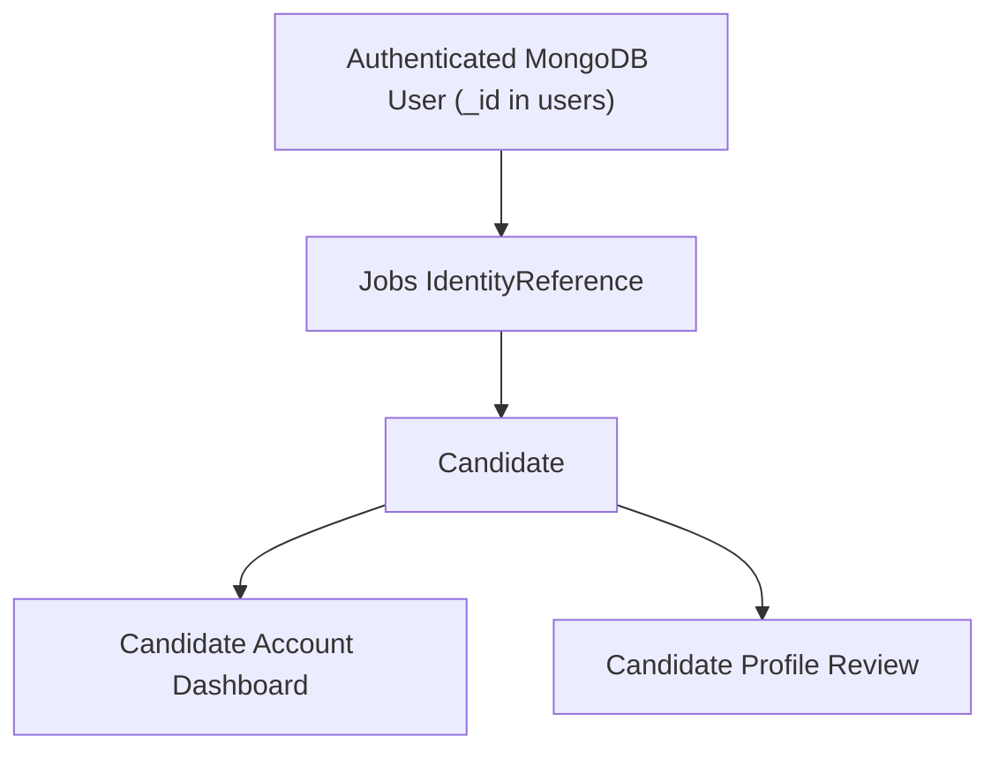

# Estabizz Jobs — Candidate Registration & Identity Initialization V1

Status: Foundation complete locally; not deployed.

## Scope

This phase initializes a Jobs candidate identity from the existing Estabizz website account. It does not introduce a second authentication system, resume upload, job applications, employer portal access, AI matching, OpenAI calls or production deployment.

## Existing Website Authentication Reuse

The existing website authentication remains authoritative:

1. `/api/auth/signup` creates a MongoDB `users` document with `firstName`, `lastName`, `email`, optional `mobile` and a password hash excluded by default.
2. `/api/auth/login` verifies credentials against MongoDB and writes an `auth_token` httpOnly cookie.
3. The cookie contains a JWT with the MongoDB user id, email and display name fields.
4. Server-side code verifies the JWT through `lib/auth/session.ts`.
5. Jobs candidate account code then reloads the MongoDB user by id and selects only safe account fields. Password hashes and tokens are never returned to Jobs code or browser state.

## Identity Flow

The V1 identity chain is:

`IdentityReference` stores `external_collection = users`, `external_id = MongoDB User._id.toString()` and `identity_type = candidate_user`. The MongoDB ObjectId is not used as a Jobs primary key. Jobs-owned entities continue to use UUID primary keys.

## Initialization Lifecycle

When an authenticated user opens `/jobs/account` or a child account route:

1. The server verifies the existing `auth_token`.
2. The server loads the MongoDB `User` by JWT user id.
3. Jobs upserts `IdentityReference` by `(external_collection, external_id)`.
4. Jobs upserts `Candidate` by `identity_ref_id`.
5. Jobs upserts minimal `CandidateContact` rows for account email and optional mobile.
6. The route receives a server-resolved candidate session containing only `candidateId`, `actorRefId`, email and display name.

Repeated dashboard loads, browser refreshes and retry requests return the same identity and candidate.

## Idempotency And Duplicate Protection

The database enforces the main duplicate protections:

- `IdentityReference` has `UNIQUE (external_collection, external_id)`.
- `Candidate.identity_ref_id` is unique.
- `CandidateContact` has `UNIQUE (candidate_id, contact_type, value)`.

The implementation uses transactional upserts rather than check-then-create logic. The browser never supplies authoritative `candidateId`, `identityReferenceId` or `userId`.

## Registration And Login Redirect

Jobs reuses the existing `/signup` and `/login` pages. Candidate account routes redirect unauthenticated users to:

- `/login?redirect=/jobs/account`
- `/login?redirect=/jobs/account/profile`
- matching account child paths as needed

Only safe internal return paths are accepted. External URLs, protocol-relative URLs and invalid paths fall back to a safe internal default.

## Account/Profile Separation

Account identity and candidate profile data remain separate. The MongoDB account email can initialize a contact foundation, but it is not treated as AI-confirmed candidate profile data. Resume-derived profile suggestions still require candidate review before confirmation.

## Candidate vs Staff Access

Candidate identities use `external_collection = users` and `identity_type = candidate_user`. Staff Jobs permissions remain separate through `StaffJobsCapability` and `admin_users` identities. Candidate initialization does not create staff capabilities and rejects an identity that already resolves to staff Jobs capability.

## Failure Handling

Safe states are:

- Authenticated with an existing candidate: load account.
- Authenticated without a candidate: initialize identity and candidate.
- Unauthenticated: redirect or return authentication required.
- Invalid MongoDB user/session: authentication required.
- Inactive candidate account: deny with a generic account-unavailable message.
- Identity conflict/staff capability: deny safely without attaching identities.

## Next Phase

The next approved phase can connect private resume upload to the server-resolved candidate identity. That phase must continue to avoid `Jobs CV/`, real CV testing, public storage URLs and browser-supplied candidate ids.
